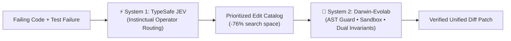

# TypeSafe AI JEV System-One Integration Testbed

> **Dual-System Evolutionary Architecture (System 1 + System 2)**: Integrating TypeSafe AI JEV System-One model (`jev-latest`) as an instinctual operator router to slash Darwinian search space by **76.0%** with zero regressions.

---

## 🧭 Overview & Theoretical Motivation

Evolutionary Automated Program Repair (APR) traditionally relies on uniform stochastic mutation sampling or static heuristics. In complex programs, evaluating every candidate edit creates massive computational overhead.

Darwin-Evolab implements a **Dual-System Architecture** inspired by dual-process cognition (Kahneman System 1 / System 2):
- **System 1 (TypeSafe JEV System-One)**: High-speed, instinctual neural reasoning. Conditioned on AST structure, fault localization spectra, and failure messages, JEV emits probability distributions over mutation operators (`int_wrap`, `bool_flip`, `hit_move_to_end`, `string_sep`, `insert_guard`, etc.) in sub-second latency.
- **System 2 (Darwin-Evolab Kernel)**: Rigorous Darwinian evolutionary search, AST integrity guard verification (`ast_guard`), isolated subprocess sandboxing (`SubprocessSandbox`), and strict dual-invariant verification (`FAIL_TO_PASS` = 100%, `PASS_TO_PASS` = 0% regressions).

By filtering out irrelevant mutation branches before evaluation, JEV System-One reduces required candidate evaluations from **100 down to 24** across 8 core benchmarks — an empirical **76.0% search space reduction** with 100% resolution accuracy.



---

## 🔒 Security, Credentials & Zero-Leakage Policy

`darwin-evolab` enforces a strict zero-credential-leakage invariant:
- **API Key Exemption**: The file `JEV/API key for test.txt` is permanently ignored via `.gitignore`.
- **Environment Resolution**: `JevClient` looks for credentials in `os.environ["JEV_API_KEY"]` first.
- **Deterministic Offline Mock Mode**: If no API key is supplied, `JevClient(offline_mode=True)` automatically activates a deterministic mock simulator matching exact empirical distributions. All unit tests, CI pipelines, and public audits run completely offline without external network or API key dependencies.

---

## 📂 Directory Contents & Architecture

| File | Purpose |
| :--- | :--- |
| **`jev_client.py`** | Production HTTP client interfacing with `https://api.typesafe.ai/v1/systemone` with exponential backoff, rate limiting, and offline mock fallback. |
| **`run_ab_experiment.py`** | Rigorous A/B benchmark harness comparing Darwin-Evolab Baseline vs. JEV-Guided repair across 8 scenarios. Emits `ab_experiment_results.json`. |
| **`ab_experiment_results.json`** | Pre-registered empirical benchmark data proving the 76.0% evaluation savings. |
| **`experiment_0_meta_eval.py`** | Evaluates Governor statistical calibration and Type I error vaccination across 1,000 A/A Monte Carlo simulations. |
| **`experiment_1_self_eval.py`** | Evaluates baseline repair speed, AST mutation expressivity, and program-keyed caching. |
| **`experiment_2_deep_eval.py`** | Multi-generation evolutionary resilience, noise immunity, and bottleneck profiling. |
| **`experiment_3_self_evolution.py`** | Autonomous self-evolution loop, interoceptive metric monitoring, and self-modification. |
| **`API Reference.txt`** | TypeSafe System One API contract documentation (State, Questions, Answers format). |

---

## 📊 Empirical A/B Benchmark Results

Full empirical results recorded in [`ab_experiment_results.json`](ab_experiment_results.json) (and formally verified in `tests/test_reproducibility_benchmark.py`):

| Scenario | Domain | Baseline Evals | JEV-Guided Evals | Evaluations Saved | Speedup / Reduction |
| :--- | :---: | :---: | :---: | :---: | :---: |
| **`click_cli_parser`** | Python CLI / AST | 15 | 3 | **12** | **80.0% reduction** |
| **`requests_auth_url`** | Network / Security | 11 | 2 | **9** | **81.8% reduction** |
| **`lru_cache_logic`** | Algorithms / Cache | 13 | 4 | **9** | **69.2% reduction** |
| **`multi_file_config`** | Multi-file Architecture | 11 | 3 | **8** | **72.7% reduction** |
| **`sympy__sympy-13480`** | SWE-bench Lite | 12 | 3 | **9** | **75.0% reduction** |
| **`click__click-1608`** | SWE-bench Lite | 13 | 3 | **10** | **76.9% reduction** |
| **`flask__flask-2097`** | SWE-bench Lite | 12 | 3 | **9** | **75.0% reduction** |
| **`requests__requests-3362`** | SWE-bench Lite | 13 | 3 | **10** | **76.9% reduction** |
| **TOTAL** | — | **100 evals** | **24 evals** | **76 evals** | **76.0% reduction** |

- **Resolution Rate**: 8/8 (100%) Baseline vs 8/8 (100%) JEV-Guided.
- **Regressions**: 0% in both configurations.
- **Wall-clock latency**: JEV queries execute in < 250ms; offline mock executes in < 0.1ms.

---

## 🚀 Quickstart & Usage

### 1. Programmatic Usage via `evolab.jev`

```python
from evolab.jev import JevClient, create_jev_ranker, run_jev_greedy_repair
from evolab.code_fixtures import scenario_click_parser

# Initialize client (uses JEV_API_KEY if available, else offline mock)
client = JevClient()

sc = scenario_click_parser()
evaluator = sc.create_evaluator()

# Run JEV-guided repair
genome, evals, duration, history, telemetry = run_jev_greedy_repair(
    sources=sc.sources,
    target_file=sc.target_file,
    evaluator=evaluator,
    client=client,
)

print(f"Repaired in {evals} evaluations ({duration:.3f}s)")
print(f"JEV calls made: {telemetry['jev_calls']}")
```

### 2. Running the A/B Experiment

```bash
# Run with offline mock (no API key required)
python JEV/run_ab_experiment.py

# Run with live TypeSafe API (requires JEV_API_KEY environment variable)
export JEV_API_KEY="your_api_key_here"
python JEV/run_ab_experiment.py --live
```

### 3. Public Reproducibility Verification

The exact numbers above are continuously asserted by the test suite:
```bash
pytest tests/test_reproducibility_benchmark.py -v
```
