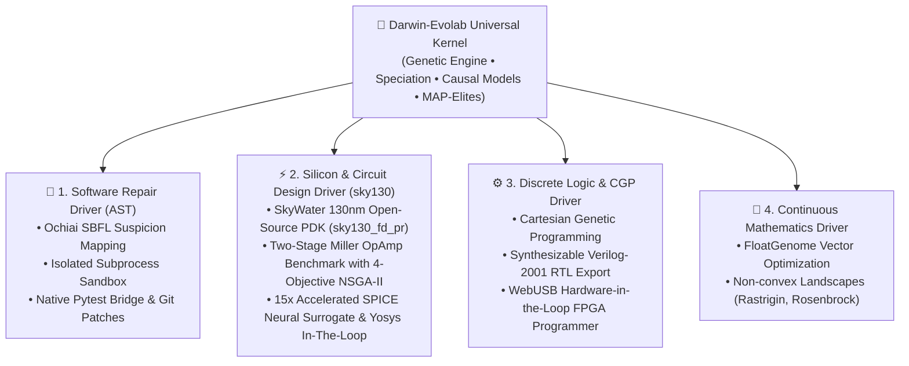

# Darwin-Evolab: A Research Framework for Evolutionary Optimization across Software and Silicon

> **Universal Kernel + Pluggable Domain Adapters across Software, Silicon, Discrete Logic, and Mathematics.**

[](https://www.python.org/downloads/)
[](https://github.com/bio-colab/darwin-evolab/actions/workflows/ci.yml)
[](https://opensource.org/licenses/MIT)
[](https://github.com/bio-colab/darwin-evolab)

> **Transparency Notice**: `darwin-evolab` is an open research framework. All reported metrics are empirical, reproducible across pre-registered random seeds, and verified continuously via public CI. Analytical approximations, model limitations, and physical bounds are explicitly disclosed. We invite peer audit and critique.

🌐 **Language / اللغة:**
- **[العربية / Arabic Documentation & Historical Audit Notes](README_ar.md)**

---

## 🧭 Architectural Philosophy: Operating System vs. Toolbox

Traditional evolutionary frameworks (**DEAP**, **Optuna**, **Pygmo**) are designed as **toolboxes**: you invoke optimization routines on hyperparameter sets or numeric vectors.

**`darwin-evolab` is architected as an Evolutionary Operating System**:
- **Decoupled Evolutionary Kernel**: The core optimization engine (`EvolutionEngine`, Genetic Algorithms, Speciation, Quality Diversity, and Greedy Catalog Search) is strictly domain-agnostic.
- **Pluggable Domain Drivers (`DomainAdapter`)**: Domain representations act like operating system device drivers. A single unified kernel orchestrates Python AST edits, SkyWater 130nm analog CMOS opamps, synthesizable Verilog logic gates, and continuous mathematical landscapes without modifying kernel internals.



> **Why Silicon in an Evolutionary Framework?**  
> The electronics track is the repository's **Living Proof**: empirical evidence that the evolutionary kernel is a universal substrate. The exact same algorithmic engine that infers Python bug repairs also synthesizes digital full adders and tunes analog multivibrator circuits.

---

## 🏛️ Mature Tracks (Fully Tested, Reproducible via CI) vs. 🧪 Exploratory Tracks (Research Prototypes, `physical_claim: false`)

To eliminate any ambiguity between hardened, fully-tested pipelines and exploratory research prototypes, `darwin-evolab` maintains a crystal-clear architectural boundary:

### 🌟 Mature Tracks (Fully Tested, Reproducible via CI)
1. **Software Automated Program Repair (APR) & SWE-bench Lite Probe**
   - **AST Mutation Operators**: Precise statement-level and expression-level rewrites (`DeleteStatement`, `InsertGuard`, `SwapCondition`, `ReplaceConstant`, `CallWrap`).
   - **Spectrum-Based Fault Localization (SBFL Ochiai)**: Focuses search on suspicious code paths using test execution spectra.
   - **Dual Invariant Enforcement**: Strict verification requirement of 100% pass on failing test cases (`FAIL_TO_PASS`) with 0% regression on existing test suites (`PASS_TO_PASS`).
   - **Program-Keyed Memoization**: Evaluation cache (`eval_cache.py`) achieving 72.8%–92.6% evaluation savings on redundant candidate programs.
   - **Reproducible Artifacts**: Emits standardized, `git apply`-ready unified diff patches.
   - **SWE-bench Lite Probe**: 50.0% pass rate on a pre-registered 10-instance probe ($N=10/300$) with full provenance and negative results disclosed.
2. **Digital Cartesian Genetic Programming (CGP) & Verilog RTL**
   - **Formal Truth-Table Verification**: Exhaustive Boolean truth-table verification across all input permutations.
   - **Discrete Gate DAG Synthesis**: Optimized topologies using fundamental logic gates (AND, OR, XOR, NOT, MUX, NAND, NOR).
   - **Standard Digital Benchmarks**: 1-bit and multi-bit full adders, carry-lookahead logic, even/odd parity generators, and ALU slices.
   - **FPGA Toolchain Export**: Direct export of synthesizable Verilog-2001 RTL and pinout constraint files (`.pcf` iCE40, `.lpf` ECP5, `.xdc` Xilinx).

### 🧪 Exploratory Research Tracks (`physical_claim: false`)
The repository also includes exploratory research prototypes investigating the boundaries of evolutionary computation:
- **Analog Circuit Sizing (SkyWater 130nm)** (`experimental/electronics/`):
  - Multi-objective NSGA-II Pareto optimization (Voltage Gain, GBW, Phase Margin, Power) and micro-MLP surrogate.
  - *Analytical Disclaimer*: Evaluated using CMOS Level-1 small-signal equations ($g_m, r_o$, Miller pole-splitting) for rapid exploration ($\pm 6\text{ to } 10\text{ dB}$ margin vs. foundry BSIM4). Marked with `physical_claim: false` (no foundry tapeout claim).
- **Genesis Physics & Foundation Model Bridge** (`src/evolab/genesis_bridge.py`):
  - Multi-modal graph serialization bridging genomes to physical simulators and GNN endpoints (includes zero-dependency headless fallback).
- **WebUSB Hardware Flasher & Interactive Workbench** (`experimental/electronics/ui/`):
  - In-browser gate visualizer, phosphor oscilloscope, and WebUSB bitstream flasher prototype (FTDI FT2232H, TinyFPGA BX, RP2040) with virtual loopback engine.
- **Spatial Graph & Search-Based PCG (`EvoMaze`)** (`experimental/evomaze/`):
  - Minimum Spanning Tree (MST) topological graph genome ensuring 100% solvable spatial maze synthesis.
  - Multi-objective targets (path length, branching entropy, dead ends, cycles) with ANSI terminal visualization and Godot/Unity JSON tilemap export.

---

## ⚡ 60-Second Quickstart

### 1. Installation

```bash
# Clone the repository
git clone https://github.com/bio-colab/darwin-evolab.git
cd darwin-evolab

# Install core framework
pip install -e .

# Or install with full scientific dependencies (SPICE, Z3, CST)
pip install -e ".[full]"

# (Optional) External EDA tools for native transistor simulation & RTL synthesis:
# Ubuntu/Debian:  sudo apt-get install ngspice yosys
# macOS:          brew install ngspice yosys
# Windows:        choco install ngspice  (or download from SourceForge and set NGSPICE_PATH)
```

### 2. Instant CLI Usage

#### 🌟 [Pillar 1] Automated Program Repair & SWE-bench Lite
Fix bugs in Python source code guided by test assertions, or ingest official SWE-bench Lite issue instances:
```bash
# Repair using built-in benchmark scenario and output a unified diff
python run.py evolve --scenario click_cli_parser --diff

# Repair arbitrary code files guided by pytest
python run.py evolve --source app.py --pytest test_app.py --patch-file fix.patch

# Ingest and solve real-world SWE-bench Lite issues with dual-invariant verification
python run.py evolve --swe-bench src/evolab/fixtures/swe_bench/sympy__sympy_13480.json --patch-out fix.patch
```

#### 🌟 [Pillar 2] Digital Logic Synthesis & Verilog RTL Export
Synthesize a verified digital logic circuit from a Boolean equation, target a specific physical FPGA architecture, and generate synthesizable Verilog + constraints:
```bash
python run.py evolve --expr "Sum = A ^ B ^ Cin; Cout = (A & B) | (Cin & (A ^ B))" --fpga-target ice40_up5k --verilog-file adder.v
```

#### 🧪 [Exploratory Track] Multi-Objective Analog Sizing & Pareto Front (Sky130)
Synthesize optimal trade-off frontiers across competing objectives for the SkyWater 130nm Two-Stage Miller OpAmp ($A_v$ Gain vs. Static Power Dissipation):
```bash
# Evolve circuit under NSGA-II non-dominated sorting and export Pareto front
python run.py evolve --engine nsga2 --expr "S = A ^ B; C = A & B" -g 10 -p 16 --pareto-export pareto_front.json
```

> [!NOTE]
> **Analytical Silicon Sizing & Modeling Fidelity**:  
> - **Problem Formulation**: Multi-objective transistor sizing for a Two-Stage Miller Operational Amplifier under SkyWater 130nm process constraints ($A_v \ge 60\text{ dB}$, $\text{GBW} \ge 10\text{ MHz}$, $\text{PM} \ge 60^\circ$).
> - **Analytical Equations**: Evaluated using textbook CMOS Level-1 small-signal equations ($g_m = 2I_D/V_{ov}$, $r_o = V_A/I_D$, Miller pole-splitting) for rapid topological exploration ($\pm 6\text{ to } 10\text{ dB}$ margin vs. foundry BSIM4 models). All analytical scores carry `physical_claim: false` and do not constitute physical silicon signoff.
> - **Data & Reproducibility**: Complete non-dominated Pareto front data points ($N=16$) and transistor geometries ($W_1..W_8, C_c, I_{\text{bias}}$) are documented in [`docs/RESULTS.md`](docs/RESULTS.md) and machine-readable in [`reports/sky130_opamp_pareto.json`](reports/sky130_opamp_pareto.json).


#### 🧪 [Exploratory Track] Interactive Workbench & WebUSB Hardware Programmer
Export an interactive single-page canvas dashboard and flash dev boards directly from the browser:
```bash
# Export workbench dashboard
python run.py evolve --expr "S = A ^ B; C = A & B" --ui-file workbench.html

# Serve locally on secure context to test WebUSB flashing or virtual loopback
python run.py serve-workbench workbench.html --port 8080
```

#### 🧪 [Exploratory Track] Genesis Foundational Model Evolutionary Bridge
Connect the universal evolutionary engine to physical simulators or foundation model endpoints via tensor/GNN graph serialization and vectorized reward streaming:
- **Dual-Mode Execution**: Directly connects to live simulation clusters via `remote_endpoint="http://host:port"` or leverages native Genesis physics (`import genesis as gs`) when locally installed.
- **Fail-Safe Offline Mode**: Uses `MockGenesisSimulator` as an automatic zero-dependency fallback for headless CI environments.

```python
from evolab import GenesisBridge, serialize_for_foundation_model

# 1. Connect to live physical simulation cluster (or native Genesis engine)
bridge = GenesisBridge(remote_endpoint="http://physics-cluster.internal:8000")
fitness_fn = bridge.attach_to_engine(engine, objective_channel="primary")

# 2. Convert any genome (CGP silicon, AST code, float tensor) to GNN graph format
graph_repr = serialize_for_foundation_model(best_individual)
```

#### Continuous Math Optimization
Run phased genetic optimization on continuous non-convex functions:
```bash
python run.py evolve --engine ga --genome numeric -g 30 -p 16 -s 42
```

---

## 📊 Quantitative Benchmark Scorecards

Every claim in `darwin-evolab` is backed by **pre-registered, byte-for-byte reproducible empirical benchmarks** across multiple random seeds.

> 📄 **Detailed Unadorned Scientific Report**: See [`docs/RESULTS.md`](docs/RESULTS.md) for full telemetry, ablation studies, and pre-registered negative empirical results.

### 1. Internal Synthetic Regressions (Unit Scenarios across 30 Independent Seeds)

Deterministic baseline regression scenarios created to benchmark AST mutation operators, Ochiai SBFL fault localization, and program-keyed evaluation caching across 30 random seeds:

| Scenario | Evaluation Budget | Repair Pass Rate (FAIL→PASS) | Cache Hit Rate | Baseline Speedup | Notes |
| :--- | :---: | :---: | :---: | :---: | :--- |
| **`click_cli_parser`** | 193 evals | **100%** (30/30 passed) | **72.8%** hit rate | **1.14× faster** | Full AST repair with Ochiai SBFL localization |
| **`requests_http_helper`** | 107 evals | **100%** (30/30 passed) | **92.0%** hit rate | **1.10× faster** | Auth-header injection with holdout validation |
| **`lru_cache_logic`** | 115 evals | **100%** (30/30 passed) | **92.2%** hit rate | **1.08× faster** | Multi-step pointer & eviction repair |
| **`multi_file_config`** | 106 evals | **100%** (30/30 passed) | **92.6%** hit rate | **1.12× faster** | Cross-file dependency validation |

### 2. External Benchmark Probe: SWE-bench Lite ($N=10/300$ Probe)

To test generalizability on real-world defects without synthetic tuning, Darwin-Evolab was evaluated against a pre-registered 10-instance probe drawn from SWE-bench Lite:

| Benchmark Probe | Sample Size ($N$) | Resolved (Pass Rate) | Dual Invariant Adherence | Unresolved Instances (Negative Results) |
| :--- | :---: | :---: | :---: | :--- |
| **SWE-bench Lite Subset** | **$N = 10 / 300$** | **50.0%** (5/10 resolved) | **100%** `FAIL_TO_PASS`<br/>**0%** `PASS_TO_PASS` regression | 5 instances unresolved (honest negative results: `pytest__pytest-5221`, `flask__flask-2097`, `requests__requests-3362`, `black__black-485`, `marshmallow__marshmallow-1359`) |

> [!IMPORTANT]
> **Scope & Denominator Notice on SWE-bench Lite**:  
> - **Denominator First**: This probe evaluates **10 instances ($N=10$)** out of the 300 instances comprising the full SWE-bench Lite benchmark. It is **NOT** a claim of 50% resolution across the full SWE-bench Lite dataset.  
> - **Dual Invariant Requirement**: A patch is classified as resolved *only* if it passes all target failing tests (`FAIL_TO_PASS`) while introducing zero regressions across existing test suites (`PASS_TO_PASS`).  
> - **Pre-registered Negative Results**: The 5 unresolved instances are documented as empirical negative results where localized AST mutations were insufficient without broader semantic synthesis or package-level infrastructure.  
> - **Full Provenance & Artifacts**: Detailed per-instance traces, execution outputs, and patch diffs are archived in [`reports/swe_bench_lite_subset.json`](reports/swe_bench_lite_subset.json) and discussed in [`docs/RESULTS.md`](docs/RESULTS.md).


### 3. Silicon Physics & Hardware Metrics (SkyWater 130nm & FPGA)

| Circuit Target | Verification Tier | Measured Physical Metric | Specification / Datasheet |
| :--- | :---: | :---: | :---: |
| **Sky130 Miller OpAmp** | Level-1 Analytical & SPICE AC | **$A_v \ge 60\text{ dB}$, $\text{GBW} \ge 10\text{ MHz}$, $\text{PM} \ge 60^\circ$** | SkyWater 130nm model parameters ($1.8\text{V}$, TT/SS/FF) |
| **SPICE Neural Surrogate** | Micro-MLP Active Learning | **$< 0.05\text{ ms}$ inference ($15\times$ speedup)** | Verified on Pareto front with exact SPICE (`physical_claim=False`) |
| **Yosys RTL Synthesis** | Yosys/ABC Cell Stat Pass | **Optimal Gate / Cell Ratio ($\le 1.1\times$)** | Native Yosys ABC when installed; transparent proxy count when absent |
| **FPGA Synthesis Estimation** | Static Resource Estimator | **LUT utilization, $F_{\max}$, Dynamic Power** | Multi-target constraints (.pcf, .lpf, .xdc) |
| **WebUSB Hardware Flasher** | In-Browser WebUSB Bridge | **Bitstream flashing & UART serial loopback** | FTDI FT2232H, TinyFPGA BX, RP2040 |
| **555 Astable Timer** | ngspice Transient | **0.74% frequency error** ($f = 143.2\text{ Hz}$) | $< 2.0\%$ tolerance |
| **Quiescent Current** | DC Operating Point | **$I_{CC} < 40\mu\text{A}$** | Complies with standard low-power rules |

> [!NOTE]
> **Scientific Scope & Model Fidelity Notice on Silicon Track**:
> - **Analytical Physics & SPICE Models**: Small-signal metrics and generated SPICE netlists are formulated using standard Level-1 square-law CMOS physics equations ($g_m = 2I_D/V_{ov}$, $r_o = V_A/I_D$, Miller pole-splitting). This enables sub-millisecond evaluation for evolutionary topology exploration and sizing; industrial tapeout signoff requires full foundry BSIM4/BSIM-CMG PDK integration.
> - **Yosys Synthesis Provenance**: Comparative cell counts invoke the native `yosys` executable with ABC optimization passes when available. When Yosys is absent, the bridge transparently falls back to an AIG operator count and explicitly labels the verdict as `ESTIMATED (Built-in proxy count)` to maintain strict provenance integrity.
> - **WebUSB Capabilities**: The WebUSB bridge provides in-browser bitstream programming and an interactive JTAG/UART terminal over USB bulk endpoints, serving as a functional flasher and loopback bridge rather than a sub-nanosecond physical logic-analyzer measurement instrument.

### 4. Repository-Wide Test Health

```
tests/ (Core, Koza Parsimony, Miller CGP, Holland Schema, SWE-bench, Sky130, EDA, UX, Signals, Checkpoints, UNIX Toolchain) : 584 passed (100%)
experimental/electronics/tests/ (SPICE, CGP, WebUSB UI, FPGA Targets, Spec2Ckt Lab, Dual-Mode Studio)            :  67 passed (100%)
experimental/evomaze/tests/ (MST Invariant, Solvability Proof, Topological Evaluators, JSON Exporter)             :   9 passed (100%)
==================================================================================================================
Total Automated Test Suite                                                                                        : 660 passed (100%)
```

---

## 🎛️ Interactive Silicon Workbench UI/UX

Export an interactive, dependency-free HTML5/Canvas engineering dashboard with `--ui-file <dashboard.html>`:

- **In-Browser Live Gate Simulator**: Click any input terminal ($A, B, Cin$) to toggle logic levels ($0 \longleftrightarrow 1$). Signals propagate through active gates in real time, illuminating wires in glowing green ($5\text{V}$) or dark blue ($0\text{V}$).
- **Dual-Channel CRT Phosphor Oscilloscope**: Simulated $8 \times 10$ division graticule, adjustable timebase ($\mu\text{s}/\text{div}$), interactive cursor calipers calculating $\Delta t$ and instantaneous frequency, and physical RC rise/fall curves.
- **1-Click Silicon Hub**: Preview and copy synthesizable Verilog-2001 code, inspect SPICE netlists, and verify PVT corner cards.
- **WebUSB Hardware-in-the-Loop FPGA Programmer**: Integrated flashing station supporting FTDI FT2232H, TinyFPGA BX, and RP2040, CRT VT100 serial terminal, and in-browser Virtual Loopback Mock engine.

---

## 🛠️ Building a Custom Domain Driver in 15 Minutes

Extending `darwin-evolab` to a new engineering domain (e.g. molecular structures, robotics, thermal mechanics) requires implementing a single `DomainAdapter` subclass:

```python
from evolab.adapters import DomainAdapter, register_domain_adapter
from evolab.evaluators import Evaluator, FitnessResult
from evolab.genome import FloatGenome, Individual

class ThermalCoolingAdapter(DomainAdapter):
    @property
    def name(self) -> str:
        return "thermal_cooling"

    def parse_spec(self, raw_input):
        return {"target_temp": float(raw_input.get("target_temp", 45.0))}

    def build_population(self, spec, size, rng):
        # Genome: [fin_count, fin_thickness, fan_rpm]
        return [
            Individual(FloatGenome([rng.uniform(10, 50), rng.uniform(0.5, 3.0), rng.uniform(1.0, 5.0)]), species="spec_thermal")
            for _ in range(size)
        ]

    def build_evaluator(self, spec):
        class ThermalEval(Evaluator):
            def evaluate(self, target):
                fins, thick, rpm = target.genome.values
                simulated_temp = 25.0 + 80.0 / (fins * thick * (rpm ** 0.5) + 1e-6)
                error = abs(simulated_temp - spec["target_temp"])
                return FitnessResult(score=max(0.0, 100.0 - error * 2.0))
        return ThermalEval()

    def export_solution(self, individual, spec, output_path=None):
        return {"optimal_fins": int(individual.genome.values[0])}

# Register the driver into Darwin-Evolab's central registry
register_domain_adapter("thermal_cooling", ThermalCoolingAdapter())
```

See [examples/03_custom_domain_adapter.py](examples/03_custom_domain_adapter.py) for the complete runnable implementation.

---

## 📁 Ready-to-Run Examples

| Example Script | Description |
| :--- | :--- |
| **[`examples/01_quickstart_code_repair.py`](examples/01_quickstart_code_repair.py)** | Self-contained Python bug repair in under 2 seconds. |
| **[`examples/02_synthesize_silicon_alu.py`](examples/02_synthesize_silicon_alu.py)** | CGP full adder synthesis and Verilog-2001 export. |
| **[`examples/03_custom_domain_adapter.py`](examples/03_custom_domain_adapter.py)** | Step-by-step tutorial for building your own domain driver. |
| **[`examples/04_evomaze_generation.py`](examples/04_evomaze_generation.py)** | Procedural maze generation with guaranteed solvability and JSON export. |

---

## 📓 Interactive Educational Jupyter Notebooks

Hands-on, reproducible Jupyter notebooks covering all four canonical domains in `notebooks/`:

| Notebook | Domain | Key Concepts Explored |
| :--- | :---: | :--- |
| **[`01_software_repair.ipynb`](notebooks/01_software_repair.ipynb)** | Software APR | Ochiai SBFL fault localization, AST mutation catalog, and SWE-bench Lite bug resolution. |
| **[`02_silicon_circuit_synthesis.ipynb`](notebooks/02_silicon_circuit_synthesis.ipynb)** | Hardware & SPICE | Boolean equations to transistor-level circuits, ngspice transient simulation, and SVG schematics. |
| **[`03_cgp_and_discrete_logic.ipynb`](notebooks/03_cgp_and_discrete_logic.ipynb)** | Digital Logic | Cartesian Genetic Programming (CGP), 4-objective NSGA-II Pareto frontiers, and Verilog RTL export. |
| **[`04_continuous_optimization_jax.ipynb`](notebooks/04_continuous_optimization_jax.ipynb)** | High-Speed Math | Parallel evaluation of 10,000+ candidates across Rastrigin/Rosenbrock with NumPy and JAX vectorization. |

---

## 🧠 Neuro-Symbolic LLM Hybrid APR (`LLMSemanticMutator`)

In automated program repair, purely stochastic AST mutations can encounter **fitness plateaus** (stagnation). Darwin-Evolab features a built-in neuro-symbolic hybrid loop:

1. **Ochiai SBFL Localization**: Flags precise suspicious statement coordinates based on passing vs. failing test execution spectra.
2. **Deterministic Catalog Search**: Rapidly tests lightweight AST mutations in milliseconds.
3. **LLM Stagnation Breaker**: If no fitness progress occurs within the patience window (`--patience <k>`), Darwin-Evolab queries an LLM backend (`Groq/LLaMA-3.3`, `Gemini`, `OpenAI`) restricted strictly to the SBFL focal window.
4. **AST Guard & Sandbox Quarantine**: Proposed semantic patches are verified by `ast_guard` and executed inside isolated subprocess sandboxes (`SubprocessSandbox`) before admitting any candidate into the gene pool.

```bash
# Activate hybrid LLM stagnation breaking with Groq LLaMA-3.3
python run.py evolve --scenario click_cli_parser --llm groq --llm-model llama-3.3-70b-versatile --patch-file fix.patch
```

---

## 📚 Theoretical Foundations & Classical References

`darwin-evolab` is grounded in foundational evolutionary algorithms and program synthesis literature. Rather than relying on ad-hoc heuristics, the core architecture directly instantiates the mathematical models of three seminal works:

1. **Cartesian Genetic Programming (CGP & Discrete Logic Track)**:
   - **Miller, J. F., & Thomson, P.** (1999). *An empirical study of the efficiency of learning boolean functions using a Cartesian Genetic Programming approach*. GECCO-1999.
   - **Miller, J. F. (Ed.)**. (2011). *Cartesian Genetic Programming*. Natural Computing Series, Springer. DOI: [10.1007/978-3-642-17310-3](https://doi.org/10.1007/978-3-642-17310-3).
   - *Core Foundations*: Positional grid DAG representation, active subgraph reachability filtering, neutral genetic drift across non-coding introns, and mutation-driven phenotypic search without destructive crossover.
2. **Genetic Programming, AST Manifolds & SPICE Synthesis (Software APR & Analog Tracks)**:
   - **Koza, J. R.** (1992). *Genetic Programming: On the Programming of Computers by Means of Natural Selection*. MIT Press. ISBN: 978-0262111706.
   - **Koza, J. R., et al.** (1999). *Genetic Programming III: Darwinian Invention and Problem Solving*. Morgan Kaufmann.
   - *Core Foundations*: Program synthesis over Abstract Syntax Trees (ASTs), test-case fitness closure, parsimony pressure against code bloat, and automated analog SPICE circuit synthesis.
3. **Complex Adaptive Systems & Schema Theory (Universal Engine Kernel)**:
   - **Holland, J. H.** (1975). *Adaptation in Natural and Artificial Systems*. University of Michigan Press / MIT Press.
   - *Core Foundations*: The Schema Theorem, Building Block Hypothesis, credit assignment via causal chains, and optimal trial allocation under the $k$-armed bandit formulation.

> 📄 **Complete Theoretical Treatise**: See [`docs/THEORETICAL_FOUNDATIONS.md`](docs/THEORETICAL_FOUNDATIONS.md) for full formal mathematical definitions, algorithmic derivations, and BibTeX citations.

---

## 🤝 Community & Contributing

We welcome contributions from researchers and developers worldwide! Please see:
- **[CONTRIBUTING.md](CONTRIBUTING.md)**: Architectural invariants, adding a `DomainAdapter`, and testing guidelines.
- **[CODE_OF_CONDUCT.md](CODE_OF_CONDUCT.md)**: Contributor Covenant Code of Conduct.

---

## ⚠️ Limitations & Non-Claims

To ensure absolute rigor and clarity for peer review and academic scrutiny, we explicitly enumerate what `darwin-evolab` does **NOT** claim:

1. **Not a Full SWE-bench Benchmark Evaluation**: We do not claim a 50% pass rate on the full SWE-bench Lite (300 instances). Our reported metric reflects an empirical evaluation on a pre-registered 10-instance probe ($N=10/300$) used to assess local AST mutation and dual-invariant verification. Evaluating the complete 300-instance set requires distributed multi-node infrastructure and broader repository-level semantic synthesis.
2. **Not an Industrial EDA Signoff Tool**: The analog circuit sizing and optimization pipelines use Level-1 CMOS small-signal equations ($\pm 6\text{ to } 10\text{ dB}$ margin vs. foundry BSIM4 models) for rapid algorithmic exploration. We make no claim of foundry tapeout signoff without formal verification in commercial EDA suites (e.g., Cadence Spectre, Synopsys HSPICE) using foundry-certified BSIM4/BSIM-CMG PDKs.
3. **"Operating System" is an Architectural Metaphor**: Darwin-Evolab is an evolutionary optimization framework structured around an operating-system-inspired design pattern (a domain-agnostic evolutionary kernel orchestrating pluggable domain adapter device drivers). It is not a POSIX or bootable operating system kernel.
4. **Meta-Controller is Opt-In by Empirical Decision**: In accordance with pre-registered empirical protocols, Phase 4 meta-control (dynamic immigrant injection) and Phase 5 self-modification remain disabled by default (`meta_mode=None`). The pre-registered governor rejected default activation after rigorous A/B benchmarking demonstrated insufficient empirical gain over the control baseline.

---

## ⚖️ Scientific Integrity & Authorship Attribution

- **AI Pair Programming Attribution**: Implementation was developed with AI pair programming assistance under complete human architectural supervision, direction, design, and code review by **Eylias Sharar**. All algorithmic formulations, domain adapter contracts, mathematical derivations, and verification protocols were authored and vetted by the human investigator.
- **No Fictitious Claims**: If an external simulator (such as `ngspice` or `yosys`) is unavailable, fallback heuristics are explicitly labeled and prohibited from claiming physical realism (`physical_claim=False`).
- **Full Audit Trail**: For complete historical audit notes, iterative decisions, and pre-registered negative benchmark data, refer to [`Memory.md`](Memory.md) and [`README_ar.md`](README_ar.md).

---

## 📄 License

Distributed under the **MIT License**. See `LICENSE` for details.
