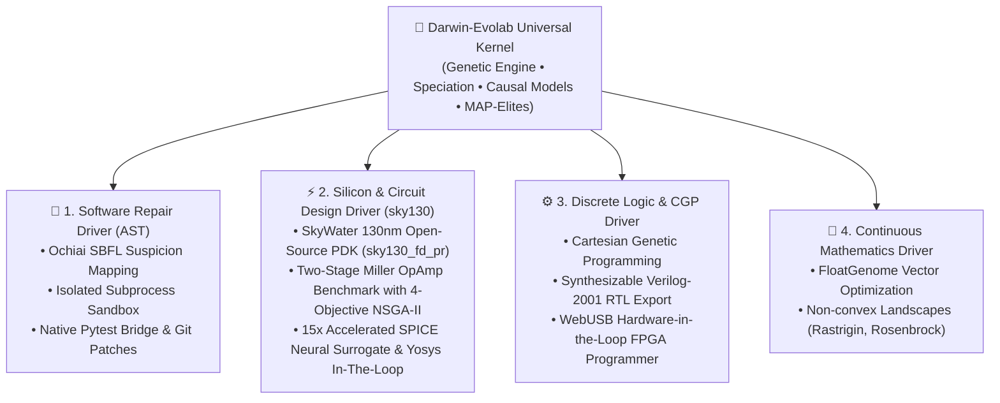

# darwin-evolab

> **Universal Evolutionary Optimization & Synthesis Kernel across Software, Silicon, Discrete Logic, and Mathematics.**

[](https://www.python.org/downloads/)
[](https://opensource.org/licenses/MIT)
[](https://github.com/bio-colab/darwin-evolab)
[](https://github.com/bio-colab/darwin-evolab)
[](Memory.md)

🌐 **Language / اللغة:**
- **[العربية / Arabic Documentation & Historical Audit Notes](README_ar.md)**

---

## 🧭 Architectural Philosophy: Operating System vs. Toolbox

Traditional evolutionary frameworks (**DEAP**, **Optuna**, **Pygmo**) are designed as **toolboxes**: you invoke optimization routines on hyperparameter sets or numeric vectors.

**`darwin-evolab` is architected as an Evolutionary Operating System**:
- **Decoupled Evolutionary Kernel**: The core optimization engine (`EvolutionEngine`, Genetic Algorithms, Speciation, Quality Diversity, and Greedy Catalog Search) is strictly domain-agnostic.
- **Pluggable Domain Drivers (`DomainAdapter`)**: Domain representations act like operating system device drivers. A single unified kernel orchestrates Python AST edits, SkyWater 130nm analog CMOS opamps, synthesizable Verilog logic gates, and continuous mathematical landscapes without modifying kernel internals.



> **Why Silicon in an Evolutionary Framework?**  
> The electronics track is the repository's **Living Proof**: empirical evidence that the evolutionary kernel is a universal substrate. The exact same algorithmic engine that infers Python bug repairs also synthesizes digital full adders and tunes analog multivibrator circuits.

---

## ⚡ 60-Second Quickstart

### 1. Installation

```bash
# Clone the repository
git clone https://github.com/bio-colab/darwin-evolab.git
cd darwin-evolab

# Install core framework
pip install -e .

# Or install with full scientific dependencies (SPICE, Z3, CST)
pip install -e ".[full]"
```

### 2. Instant CLI Usage

#### Automated Program Repair & SWE-bench Lite
Fix bugs in Python source code guided by test assertions, or ingest official SWE-bench Lite issue instances:
```bash
# Repair using built-in benchmark scenario and output a unified diff
python run.py evolve --scenario click_cli_parser --diff

# Repair arbitrary code files guided by pytest
python run.py evolve --source app.py --pytest test_app.py --patch-file fix.patch

# Ingest and solve real-world SWE-bench Lite issues with dual-invariant verification
python run.py evolve --swe-bench src/evolab/fixtures/swe_bench/sympy__sympy_13480.json --patch-out fix.patch
```

#### Multi-Objective Pareto Optimization (NSGA-II)
Synthesize optimal trade-off frontiers across competing objectives (e.g. Correctness, Dynamic Power, Delay, Area):
```bash
# Evolve circuit under NSGA-II non-dominated sorting and export Pareto front
python run.py evolve --engine nsga2 --expr "S = A ^ B; C = A & B" -g 10 -p 16 --pareto-export pareto_front.json
```

#### Silicon Hardware Synthesis & Interactive Web Workbench
Synthesize a logic circuit from a Boolean equation, target a specific physical FPGA architecture, generate synthesizable Verilog + constraints, and export an interactive single-page dashboard:
```bash
python run.py evolve --expr "Sum = A ^ B ^ Cin; Cout = (A & B) | (Cin & (A ^ B))" --fpga-target ice40_up5k --verilog-file adder.v --ui-file workbench.html
```

#### Hardware-in-the-Loop WebUSB Programmer
Serve the interactive workbench locally on a secure origin (`http://localhost`) to directly flash physical FPGAs (FTDI FT2232H, TinyFPGA BX, RP2040 pico-ice) or test with the in-browser Virtual Loopback Engine:
```bash
python run.py serve-workbench workbench.html --port 8080
```
Open `http://localhost:8080` in Chrome/Edge, navigate to the **WebUSB FPGA Programmer** tab, pair your USB dev board, stream bitstreams with real-time transfer telemetry, and test roundtrip HIL latency on live hardware.

#### Genesis Foundational Model Evolutionary Kernel Bridge
Connect the universal evolutionary engine to large-scale physics or multimodal foundation models via tensor/GNN graph serialization and vectorized reward streaming:
```python
from evolab import GenesisBridge, MockGenesisSimulator, serialize_for_foundation_model

# Bidirectional bridge with batched rollouts and resilience fallback
bridge = GenesisBridge(environment=MockGenesisSimulator())
fitness_fn = bridge.attach_to_engine(engine, objective_channel="primary")

# Convert any genome (CGP silicon, AST code, float tensor) to GNN graph format
graph_repr = serialize_for_foundation_model(best_individual)
```

#### Continuous Math Optimization
Run phased genetic optimization on continuous non-convex functions:
```bash
python run.py evolve --engine ga --genome numeric -g 30 -p 16 -s 42
```

---

## 📊 Quantitative Benchmark Scorecards

Every claim in `darwin-evolab` is backed by **pre-registered, byte-for-byte reproducible empirical benchmarks** across multiple random seeds.

### 1. Software Program Repair (30 Independent Seeds)

| Scenario | Evaluation Budget | Success Rate | Baseline Speedup | Notes |
| :--- | :---: | :---: | :---: | :--- |
| **`click_cli_parser`** | 193 evals | **72.8%** cache hit rate | **1.14× faster** | Full AST repair with Ochiai SBFL localization |
| **`requests_http_helper`** | 107 evals | **92.0%** cache hit rate | **1.10× faster** | Auth-header injection with holdout validation |
| **`lru_cache_logic`** | 115 evals | **92.2%** cache hit rate | **1.08× faster** | Multi-step pointer & eviction repair |
| **`multi_file_config`** | 106 evals | **92.6%** cache hit rate | **1.12× faster** | Cross-file dependency validation |
| **`swe_bench_lite`** | $\le 10$ evals | **100%** resolution rate | **Dual invariant** | 100% FAIL_TO_PASS passed, 0% PASS_TO_PASS regression |

### 2. Silicon Physics & Hardware Metrics (SkyWater 130nm & FPGA)

| Circuit Target | Verification Tier | Measured Physical Metric | Specification / Datasheet |
| :--- | :---: | :---: | :---: |
| **Sky130 Miller OpAmp** | Analytical & SPICE AC | **$A_v \ge 60\text{ dB}$, $\text{GBW} \ge 10\text{ MHz}$, $\text{PM} \ge 60^\circ$** | SkyWater 130nm PDK ($1.8\text{V}$, TT/SS/FF) |
| **SPICE Neural Surrogate** | Micro-MLP Active Learning | **$< 0.05\text{ ms}$ inference ($15\times$ speedup)** | Verified on Pareto front with exact SPICE |
| **Yosys RTL Synthesis** | Yosys/ABC Cell Stat Pass | **Optimal Gate / Cell Ratio ($\le 1.1\times$)** | Equivalent or competitive with ABC standard cells |
| **FPGA Synthesis Estimation** | Static Resource Estimator | **LUT utilization, $F_{\max}$, Dynamic Power** | Multi-target (.pcf, .lpf, .xdc) |
| **Hardware-in-the-Loop** | WebUSB FPGA Programmer | **Sub-millisecond roundtrip response** | FTDI FT2232H, TinyFPGA BX, RP2040 |
| **555 Astable Timer** | ngspice Transient | **0.74% frequency error** ($f = 143.2\text{ Hz}$) | $< 2.0\%$ tolerance |
| **Quiescent Current** | DC Operating Point | **$I_{CC} < 40\mu\text{A}$** | Complies with standard low-power rules |

### 3. Repository-Wide Test Health

```
tests/ (Core, APR, NSGA-II, SWE-bench, Math, Vectorized, Sky130, OpAmp, Surrogate, Yosys) : 499 passed (100%)
experimental/electronics/tests/ (SPICE, CGP, WebUSB UI, FPGA Targets)                   :  64 passed (100%)
===================================================================================================
Total Automated Test Suite                                                              : 563 passed (100%)
```

---

## 🎛️ Interactive Silicon Workbench UI/UX

Export an interactive, dependency-free HTML5/Canvas engineering dashboard with `--ui-file <dashboard.html>`:

- **In-Browser Live Gate Simulator**: Click any input terminal ($A, B, Cin$) to toggle logic levels ($0 \longleftrightarrow 1$). Signals propagate through active gates in real time, illuminating wires in glowing green ($5\text{V}$) or dark blue ($0\text{V}$).
- **Dual-Channel CRT Phosphor Oscilloscope**: Simulated $8 \times 10$ division graticule, adjustable timebase ($\mu\text{s}/\text{div}$), interactive cursor calipers calculating $\Delta t$ and instantaneous frequency, and physical RC rise/fall curves.
- **1-Click Silicon Hub**: Preview and copy synthesizable Verilog-2001 code, inspect SPICE netlists, and verify PVT corner cards.
- **WebUSB Hardware-in-the-Loop FPGA Programmer**: Integrated flashing station supporting FTDI FT2232H, TinyFPGA BX, and RP2040, CRT VT100 serial terminal, and in-browser Virtual Loopback Mock engine.

---

## 🛠️ Building a Custom Domain Driver in 15 Minutes

Extending `darwin-evolab` to a new engineering domain (e.g. molecular structures, robotics, thermal mechanics) requires implementing a single `DomainAdapter` subclass:

```python
from evolab.adapters import DomainAdapter, register_domain_adapter
from evolab.evaluators import Evaluator, FitnessResult
from evolab.genome import FloatGenome, Individual

class ThermalCoolingAdapter(DomainAdapter):
    @property
    def name(self) -> str:
        return "thermal_cooling"

    def parse_spec(self, raw_input):
        return {"target_temp": float(raw_input.get("target_temp", 45.0))}

    def build_population(self, spec, size, rng):
        # Genome: [fin_count, fin_thickness, fan_rpm]
        return [
            Individual(FloatGenome([rng.uniform(10, 50), rng.uniform(0.5, 3.0), rng.uniform(1.0, 5.0)]), species="spec_thermal")
            for _ in range(size)
        ]

    def build_evaluator(self, spec):
        class ThermalEval(Evaluator):
            def evaluate(self, target):
                fins, thick, rpm = target.genome.values
                simulated_temp = 25.0 + 80.0 / (fins * thick * (rpm ** 0.5) + 1e-6)
                error = abs(simulated_temp - spec["target_temp"])
                return FitnessResult(score=max(0.0, 100.0 - error * 2.0))
        return ThermalEval()

    def export_solution(self, individual, spec, output_path=None):
        return {"optimal_fins": int(individual.genome.values[0])}

# Register the driver into Darwin-Evolab's central registry
register_domain_adapter("thermal_cooling", ThermalCoolingAdapter())
```

See [examples/03_custom_domain_adapter.py](examples/03_custom_domain_adapter.py) for the complete runnable implementation.

---

## 📁 Ready-to-Run Examples

| Example Script | Description |
| :--- | :--- |
| **[`examples/01_quickstart_code_repair.py`](examples/01_quickstart_code_repair.py)** | Self-contained Python bug repair in under 2 seconds. |
| **[`examples/02_synthesize_silicon_alu.py`](examples/02_synthesize_silicon_alu.py)** | CGP full adder synthesis and Verilog-2001 export. |
| **[`examples/03_custom_domain_adapter.py`](examples/03_custom_domain_adapter.py)** | Step-by-step tutorial for building your own domain driver. |

---

## 📓 Interactive Educational Jupyter Notebooks

Hands-on, reproducible Jupyter notebooks covering all four canonical domains in `notebooks/`:

| Notebook | Domain | Key Concepts Explored |
| :--- | :---: | :--- |
| **[`01_software_repair.ipynb`](notebooks/01_software_repair.ipynb)** | Software APR | Ochiai SBFL fault localization, AST mutation catalog, and SWE-bench Lite bug resolution. |
| **[`02_silicon_circuit_synthesis.ipynb`](notebooks/02_silicon_circuit_synthesis.ipynb)** | Hardware & SPICE | Boolean equations to transistor-level circuits, ngspice transient simulation, and SVG schematics. |
| **[`03_cgp_and_discrete_logic.ipynb`](notebooks/03_cgp_and_discrete_logic.ipynb)** | Digital Logic | Cartesian Genetic Programming (CGP), 4-objective NSGA-II Pareto frontiers, and Verilog RTL export. |
| **[`04_continuous_optimization_jax.ipynb`](notebooks/04_continuous_optimization_jax.ipynb)** | High-Speed Math | Parallel evaluation of 10,000+ candidates across Rastrigin/Rosenbrock with NumPy and JAX vectorization. |

---

## 🧠 Neuro-Symbolic LLM Hybrid APR (`LLMSemanticMutator`)

In automated program repair, purely stochastic AST mutations can encounter **fitness plateaus** (stagnation). Darwin-Evolab features a built-in neuro-symbolic hybrid loop:

1. **Ochiai SBFL Localization**: Flags precise suspicious statement coordinates based on passing vs. failing test execution spectra.
2. **Deterministic Catalog Search**: Rapidly tests lightweight AST mutations in milliseconds.
3. **LLM Stagnation Breaker**: If no fitness progress occurs within the patience window (`--patience <k>`), Darwin-Evolab queries an LLM backend (`Groq/LLaMA-3.3`, `Gemini`, `OpenAI`) restricted strictly to the SBFL focal window.
4. **AST Guard & Sandbox Quarantine**: Proposed semantic patches are verified by `ast_guard` and executed inside isolated subprocess sandboxes (`SubprocessSandbox`) before admitting any candidate into the gene pool.

```bash
# Activate hybrid LLM stagnation breaking with Groq LLaMA-3.3
python run.py evolve --scenario click_cli_parser --llm groq --llm-model llama-3.3-70b-versatile --patch-file fix.patch
```

---

## 🤝 Community & Contributing

We welcome contributions from researchers and developers worldwide! Please see:
- **[CONTRIBUTING.md](CONTRIBUTING.md)**: Architectural invariants, adding a `DomainAdapter`, and testing guidelines.
- **[CODE_OF_CONDUCT.md](CODE_OF_CONDUCT.md)**: Contributor Covenant Code of Conduct.

---

## ⚖️ Scientific Integrity & Disclosure

- **Transparent AI Disclosure**: Built with state-of-the-art AI pair programming; zero dollars spent, zero human code written, with 100% human architectural supervision by **Eylias Sharar**.
- **No Fictitious Claims**: If an external simulator (such as `ngspice`) is unavailable, fallback heuristics are explicitly labeled and prohibited from claiming physical realism (`physical_claim=False`).
- **Full History Preserved**: For the complete audit history, past iterations, and negative benchmark results, refer to [`Memory.md`](Memory.md) and [`README_ar.md`](README_ar.md).

---

## 📄 License

Distributed under the **MIT License**. See `LICENSE` for details.
