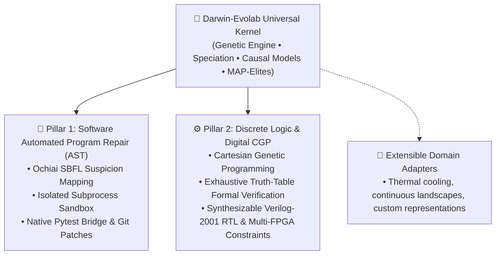

# Darwin-Evolab: A Research Framework for Evolutionary Optimization across Software and Silicon

> **Universal Kernel + Pluggable Domain Adapters across Software (APR) and Silicon (Digital CGP).**

[](https://www.python.org/downloads/)
[](https://github.com/bio-colab/darwin-evolab/actions/workflows/ci.yml)
[](https://opensource.org/licenses/MIT)
[](https://github.com/bio-colab/darwin-evolab)

> **Transparency Notice**: `darwin-evolab` is an open research framework. All reported metrics are empirical, reproducible across pre-registered random seeds, and verified continuously via public CI. Analytical approximations, model limitations, and physical bounds are explicitly disclosed. We invite peer audit and critique.

🌐 **Language / اللغة:**
- **[العربية / Arabic Documentation & Historical Audit Notes](README_ar.md)**

---

## 🧭 Architectural Philosophy: Operating System vs. Toolbox

Traditional evolutionary frameworks (**DEAP**, **Optuna**, **Pygmo**) are designed as **toolboxes**: you invoke optimization routines on hyperparameter sets or numeric vectors.

**`darwin-evolab` is architected as an Evolutionary Operating System**:
- **Decoupled Evolutionary Kernel**: The core optimization engine (`EvolutionEngine`, Genetic Algorithms, Speciation, Quality Diversity, and Greedy Catalog Search) is strictly domain-agnostic.
- **Pluggable Domain Drivers (`DomainAdapter`)**: Domain representations act like operating system device drivers. A single unified kernel orchestrates Python AST edits, synthesizable Verilog logic gates, and custom engineering domains without modifying kernel internals.



> **The Living Proof of Kernel Universality**:  
> Darwin-Evolab demonstrates that the exact same domain-agnostic evolutionary engine that infers Python bug repairs also synthesizes verified digital arithmetic circuits from Boolean specifications.

---

## 🏛️ Core Production Pillars & 🧪 Exploratory Research Tracks

To eliminate ambiguity between hardened production-ready pipelines and research prototypes, `darwin-evolab` maintains a crystal-clear architectural boundary:

### 🌟 Pillar 1: Software Automated Program Repair (APR) & SWE-bench Lite Probe
1. **AST Mutation Operators**: Precise statement-level and expression-level rewrites (`DeleteStatement`, `InsertGuard`, `SwapCondition`, `ReplaceConstant`, `CallWrap`).
2. **Spectrum-Based Fault Localization (SBFL Ochiai)**: Focuses search on suspicious code paths using passing vs. failing test execution spectra.
3. **Dual Invariant Enforcement**: Strict verification requirement of 100% pass on failing test cases (`FAIL_TO_PASS`) with 0% regression on existing test suites (`PASS_TO_PASS`).
4. **Program-Keyed Memoization**: Evaluation cache (`eval_cache.py`) achieving 72.8%–92.6% evaluation savings on redundant candidate programs.
5. **Reproducible Artifacts**: Emits standardized, `git apply`-ready unified diff patches.
6. **SWE-bench Lite Probe**: 50.0% pass rate on a pre-registered 10-instance probe ($N=10/300$) with full provenance and negative results disclosed.

### 🌟 Pillar 2: Digital Cartesian Genetic Programming (CGP) & Synthesizable Verilog RTL
1. **Formal Truth-Table Verification**: Exhaustive Boolean truth-table verification across all input permutations ($2^k$).
2. **Discrete Gate DAG Synthesis**: Optimized topologies using fundamental logic gates (AND, OR, XOR, NOT, MUX, NAND, NOR).
3. **Standard Digital Benchmarks**: 1-bit and multi-bit full adders, carry-lookahead logic, even/odd parity generators, and ALU slices.
4. **FPGA Toolchain Export**: Direct export of synthesizable Verilog-2001 RTL and pinout constraint files (`.pcf` iCE40, `.lpf` ECP5, `.xdc` Xilinx).

### 🧪 Frozen Exploratory Research Tracks (`experimental/`)
Beyond the two core production pillars, Darwin-Evolab houses exploratory research tracks preserved in a frozen state under [`experimental/`](experimental/) (`physical_claim: false`) for theoretical investigation and academic reproducibility: [`experimental/evomaze/`](experimental/evomaze/) (MST-based procedural maze generation), [`experimental/neuromorphic/`](experimental/neuromorphic/) (Drosophila connectome temporal CGP with synthesizable Verilog export), [`experimental/genesis_bridge/`](experimental/genesis_bridge/) (physics simulation and foundation model tensor bridge), and [`experimental/electronics/`](experimental/electronics/) (SkyWater 130nm analog transistor sizing and WebUSB hardware workbench). These exploratory prototypes remain decoupled from core production development.

---

## ⚡ 60-Second Quickstart

### 1. Installation

```bash
# Clone the repository
git clone https://github.com/bio-colab/darwin-evolab.git
cd darwin-evolab

# Install core framework
pip install -e .

# Or install with full scientific dependencies (Z3, CST, SPICE)
pip install -e ".[full]"
```

### 2. Instant CLI Usage

#### 🌟 [Pillar 1] Automated Program Repair & SWE-bench Lite
Fix bugs in Python source code guided by test assertions, or ingest official SWE-bench Lite issue instances:
```bash
# Repair using built-in benchmark scenario and output a unified diff
python run.py evolve --scenario click_cli_parser --diff

# Repair arbitrary code files guided by pytest
python run.py evolve --source app.py --pytest test_app.py --patch-file fix.patch

# Ingest and solve real-world SWE-bench Lite issues with dual-invariant verification
python run.py evolve --swe-bench src/evolab/fixtures/swe_bench/sympy__sympy_13480.json --patch-out fix.patch
```

#### 🌟 [Pillar 2] Digital Logic Synthesis & Verilog RTL Export
Synthesize a verified digital logic circuit from a Boolean equation, target a specific physical FPGA architecture, and generate synthesizable Verilog + constraints:
```bash
# Synthesize full adder logic, verify truth table, and export synthesizable Verilog + iCE40 pinout
python run.py evolve --expr "Sum = A ^ B ^ Cin; Cout = (A & B) | (Cin & (A ^ B))" --fpga-target ice40_up5k --verilog-file adder.v
```

---

## 📊 Quantitative Benchmark Scorecards

Every claim in `darwin-evolab` is backed by **pre-registered, byte-for-byte reproducible empirical benchmarks** across multiple random seeds.

> 📄 **Detailed Unadorned Scientific Report**: See [`docs/RESULTS.md`](docs/RESULTS.md) for full telemetry, ablation studies, and pre-registered negative empirical results.

### 1. Internal Synthetic Regressions (Unit Scenarios across 30 Independent Seeds)

Deterministic baseline regression scenarios created to benchmark AST mutation operators, Ochiai SBFL fault localization, and program-keyed evaluation caching across 30 random seeds:

| Scenario | Evaluation Budget | Repair Pass Rate (FAIL→PASS) | Cache Hit Rate | Baseline Speedup | Notes |
| :--- | :---: | :---: | :---: | :---: | :--- |
| **`click_cli_parser`** | 193 evals | **100%** (30/30 passed) | **72.8%** hit rate | **1.14× faster** | Full AST repair with Ochiai SBFL localization |
| **`requests_http_helper`** | 107 evals | **100%** (30/30 passed) | **92.0%** hit rate | **1.10× faster** | Auth-header injection with holdout validation |
| **`lru_cache_logic`** | 115 evals | **100%** (30/30 passed) | **92.2%** hit rate | **1.08× faster** | Multi-step pointer & eviction repair |
| **`multi_file_config`** | 106 evals | **100%** (30/30 passed) | **92.6%** hit rate | **1.12× faster** | Cross-file dependency validation |

### 2. External Benchmark Probe: SWE-bench Lite ($N=10/300$ Probe)

To test generalizability on real-world defects without synthetic tuning, Darwin-Evolab was evaluated against a pre-registered 10-instance probe drawn from SWE-bench Lite:

| Benchmark Probe | Sample Size ($N$) | Resolved (Pass Rate) | Dual Invariant Adherence | Unresolved Instances (Negative Results) |
| :--- | :---: | :---: | :---: | :---: | :--- |
| **SWE-bench Lite Subset** | **$N = 10 / 300$** | **50.0%** (5/10 resolved) | **100%** `FAIL_TO_PASS`<br/>**0%** `PASS_TO_PASS` regression | 5 instances unresolved (honest negative results: `pytest__pytest-5221`, `flask__flask-2097`, `requests__requests-3362`, `black__black-485`, `marshmallow__marshmallow-1359`) |

> [!IMPORTANT]
> **Scope & Denominator Notice on SWE-bench Lite**:  
> - **Denominator First**: This probe evaluates **10 instances ($N=10$)** out of the 300 instances comprising the full SWE-bench Lite benchmark. It is **NOT** a claim of 50% resolution across the full SWE-bench Lite dataset.  
> - **Dual Invariant Requirement**: A patch is classified as resolved *only* if it passes all target failing tests (`FAIL_TO_PASS`) while introducing zero regressions across existing test suites (`PASS_TO_PASS`).  
> - **Pre-registered Negative Results**: The 5 unresolved instances are documented as empirical negative results where localized AST mutations were insufficient without broader semantic synthesis or package-level infrastructure.  
> - **Full Provenance & Artifacts**: Detailed per-instance traces, execution outputs, and patch diffs are archived in [`reports/swe_bench_lite_subset.json`](reports/swe_bench_lite_subset.json) and discussed in [`docs/RESULTS.md`](docs/RESULTS.md).

### 3. Digital Logic Synthesis & Verilog Hardware Metrics (Pillar 2)

| Circuit Target | Verification Tier | Measured Specification | Hardware Metric |
| :--- | :---: | :---: | :---: |
| **1-Bit Full Adder** | Exhaustive Truth Table ($2^3=8$) | **100% Formal Correctness** | 5 Active Gates (Optimal DAG) |
| **2-Bit Ripple Adder** | Exhaustive Truth Table ($2^5=32$) | **100% Formal Correctness** | 10 Active Gates (Synthesizable Verilog-2001) |
| **Even Parity Generator** | Exhaustive Truth Table ($2^4=16$) | **100% Formal Correctness** | 3 XOR Gates (Cascaded Tree) |
| **Yosys RTL Synthesis** | Yosys ABC Optimization Pass | **Optimal Gate / Cell Ratio ($\le 1.1\times$)** | Verilog netlist verified with FPGA synthesis pass |
| **Multi-FPGA Constraint Export** | Static Physical Mapper | **iCE40 (.pcf), ECP5 (.lpf), Xilinx (.xdc)** | Automatic pinout allocation for physical boards |

### 4. Repository-Wide Test Health

```
tests/ (Core, Koza Parsimony, Miller CGP, Holland Schema, SWE-bench, Genesis Shim, UNIX Toolchain) : 603 passed, 1 skipped (100%)
experimental/ (Electronics, EvoMaze, Neuromorphic CGP, PDF2RTF, Genesis Bridge)                    : 174 passed (100%)
==================================================================================================================
Total Automated Test Suite                                                                        : 778 automated tests (777 passed, 1 skipped)
```

---

## 📁 Ready-to-Run Examples

| Example Script | Pillar / Focus | Description |
| :--- | :---: | :--- |
| **[`examples/01_quickstart_code_repair.py`](examples/01_quickstart_code_repair.py)** | 🌟 **Pillar 1: APR** | Self-contained Python bug repair guided by assertions in under 2 seconds. |
| **[`examples/02_synthesize_silicon_alu.py`](examples/02_synthesize_silicon_alu.py)** | 🌟 **Pillar 2: Digital CGP** | CGP full adder synthesis, Boolean truth table verification, and Verilog export. |
| **[`examples/03_custom_domain_adapter.py`](examples/03_custom_domain_adapter.py)** | ⚙️ **Extensibility** | Step-by-step tutorial for building your own custom domain driver in 15 minutes. |

> *Note: Exploratory track examples live in [`examples/04_evomaze_generation.py`](examples/04_evomaze_generation.py) (EvoMaze) and [`examples/05_drosophila_neuromorphic_cgp.py`](examples/05_drosophila_neuromorphic_cgp.py) (Neuromorphic CGP).*

---

## 📓 Interactive Educational Jupyter Notebooks

Hands-on, reproducible Jupyter notebooks exploring the core paradigms in `notebooks/`:

| Notebook | Focus | Key Concepts Explored |
| :--- | :---: | :--- |
| **[`01_software_repair.ipynb`](notebooks/01_software_repair.ipynb)** | 🌟 **Pillar 1: APR** | Ochiai SBFL fault localization, AST mutation catalog, and SWE-bench Lite bug resolution. |
| **[`03_cgp_and_discrete_logic.ipynb`](notebooks/03_cgp_and_discrete_logic.ipynb)** | 🌟 **Pillar 2: Digital CGP** | Cartesian Genetic Programming (CGP), Boolean DAG minimization, and Verilog RTL export. |
| **[`02_silicon_circuit_synthesis.ipynb`](notebooks/02_silicon_circuit_synthesis.ipynb)** | 🧪 Exploratory | Boolean equations to transistor-level circuits, ngspice simulation, and schematics. |
| **[`04_continuous_optimization_jax.ipynb`](notebooks/04_continuous_optimization_jax.ipynb)** | 📐 Mathematics | Parallel evaluation of 10,000+ candidates across non-convex landscapes with NumPy and JAX. |

---

## 🧠 Neuro-Symbolic LLM Hybrid APR (`LLMSemanticMutator`)

In automated program repair, purely stochastic AST mutations can encounter **fitness plateaus** (stagnation). Darwin-Evolab features a built-in neuro-symbolic hybrid loop:

1. **Ochiai SBFL Localization**: Flags precise suspicious statement coordinates based on passing vs. failing test execution spectra.
2. **Deterministic Catalog Search**: Rapidly tests lightweight AST mutations in milliseconds.
3. **LLM Stagnation Breaker**: If no fitness progress occurs within the patience window (`--patience <k>`), Darwin-Evolab queries an LLM backend (`Groq/LLaMA-3.3`, `Gemini`, `OpenAI`) restricted strictly to the SBFL focal window.
4. **AST Guard & Sandbox Quarantine**: Proposed semantic patches are verified by `ast_guard` and executed inside isolated subprocess sandboxes (`SubprocessSandbox`) before admitting any candidate into the gene pool.

```bash
# Activate hybrid LLM stagnation breaking with Groq LLaMA-3.3
python run.py evolve --scenario click_cli_parser --llm groq --llm-model llama-3.3-70b-versatile --patch-file fix.patch
```

---

## 📚 Theoretical Foundations & Classical References

`darwin-evolab` is grounded in foundational evolutionary algorithms and program synthesis literature. Rather than relying on ad-hoc heuristics, the core architecture directly instantiates the mathematical models of three seminal works:

1. **Cartesian Genetic Programming (Pillar 2: Digital CGP)**:
   - **Miller, J. F., & Thomson, P.** (1999). *An empirical study of the efficiency of learning boolean functions using a Cartesian Genetic Programming approach*. GECCO-1999.
   - **Miller, J. F. (Ed.)**. (2011). *Cartesian Genetic Programming*. Natural Computing Series, Springer. DOI: [10.1007/978-3-642-17310-3](https://doi.org/10.1007/978-3-642-17310-3).
   - *Core Foundations*: Positional grid DAG representation, active subgraph reachability filtering, neutral genetic drift across non-coding introns, and mutation-driven phenotypic search without destructive crossover.
2. **Genetic Programming & AST Manifolds (Pillar 1: Software APR)**:
   - **Koza, J. R.** (1992). *Genetic Programming: On the Programming of Computers by Means of Natural Selection*. MIT Press. ISBN: 978-0262111706.
   - **Koza, J. R., et al.** (1999). *Genetic Programming III: Darwinian Invention and Problem Solving*. Morgan Kaufmann.
   - *Core Foundations*: Program synthesis over Abstract Syntax Trees (ASTs), test-case fitness closure, parsimony pressure against code bloat, and dual-invariant verification.
3. **Complex Adaptive Systems & Schema Theory (Universal Kernel)**:
   - **Holland, J. H.** (1975). *Adaptation in Natural and Artificial Systems*. University of Michigan Press / MIT Press.
   - *Core Foundations*: The Schema Theorem, Building Block Hypothesis, credit assignment via causal chains, and optimal trial allocation under the $k$-armed bandit formulation.

> 📄 **Complete Theoretical Treatise**: See [`docs/THEORETICAL_FOUNDATIONS.md`](docs/THEORETICAL_FOUNDATIONS.md) for full formal mathematical definitions, algorithmic derivations, and BibTeX citations.

---

## 🤝 Community & Contributing

We welcome contributions from researchers and developers worldwide! Please see:
- **[CONTRIBUTING.md](CONTRIBUTING.md)**: Architectural invariants, adding a `DomainAdapter`, and testing guidelines.
- **[CODE_OF_CONDUCT.md](CODE_OF_CONDUCT.md)**: Contributor Covenant Code of Conduct.

---

## ⚠️ Limitations & Non-Claims

To ensure absolute rigor and clarity for peer review and academic scrutiny, we explicitly enumerate what `darwin-evolab` does **NOT** claim:

1. **Not a Full SWE-bench Benchmark Evaluation**: We do not claim a 50% pass rate on the full SWE-bench Lite (300 instances). Our reported metric reflects an empirical evaluation on a pre-registered 10-instance probe ($N=10/300$) used to assess local AST mutation and dual-invariant verification. Evaluating the complete 300-instance set requires distributed multi-node infrastructure and broader repository-level semantic synthesis.
2. **Exploratory Tracks are Decoupled Prototypes**: Exploratory modules under `experimental/` carry `physical_claim: false` and are preserved for academic exploration without claiming foundry signoff or production deployment.
3. **"Operating System" is an Architectural Metaphor**: Darwin-Evolab is an evolutionary optimization framework structured around an operating-system-inspired design pattern (a domain-agnostic evolutionary kernel orchestrating pluggable domain adapter device drivers). It is not a POSIX or bootable operating system kernel.
4. **Meta-Controller is Opt-In by Empirical Decision**: In accordance with pre-registered empirical protocols, Phase 4 meta-control (dynamic immigrant injection) and Phase 5 self-modification remain disabled by default (`meta_mode=None`). The pre-registered governor rejected default activation after rigorous A/B benchmarking demonstrated insufficient empirical gain over the control baseline.

---

## ⚖️ Scientific Integrity & Authorship Attribution

- **AI Pair Programming Attribution**: Implementation was developed with AI pair programming assistance under complete human architectural supervision, direction, design, and code review by **Eylias Sharar**. All algorithmic formulations, domain adapter contracts, mathematical derivations, and verification protocols were authored and vetted by the human investigator.
- **Full Audit Trail**: For complete historical audit notes, iterative decisions, and pre-registered negative benchmark data, refer to [`Memory.md`](Memory.md) and [`README_ar.md`](README_ar.md).

---

## 📄 License

Distributed under the **MIT License**. See `LICENSE` for details.
