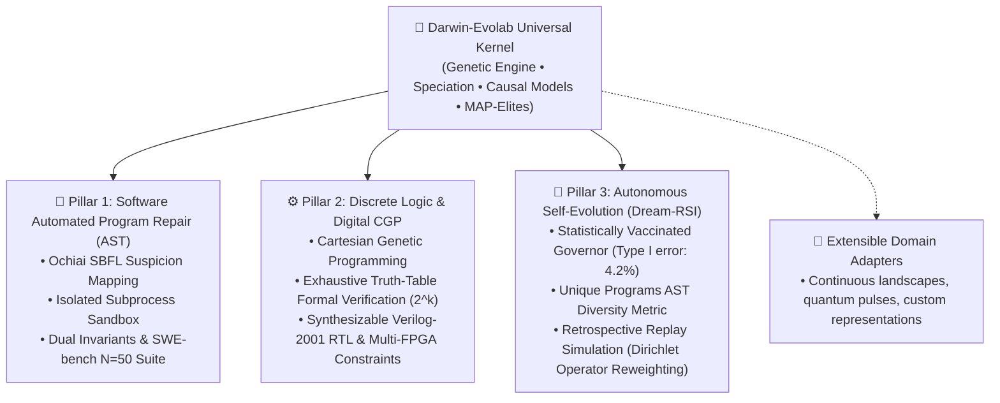

# Darwin-Evolab: Evolutionary Optimization across Software and Silicon

> **Fast, zero-LLM automated code repair and evolutionary digital circuit synthesis.**  
> *A domain-agnostic evolutionary operating system orchestrating Python AST repairs, synthesizable Verilog RTL, and continuous high-dimensional optimization in milliseconds.*

[](https://www.python.org/downloads/)
[](https://colab.research.google.com/github/bio-colab/darwin-evolab/blob/main/kaggle_bundle/darwin_evolab_grand_run.ipynb)
[](https://github.com/bio-colab/darwin-evolab/actions/workflows/ci.yml)
[](https://opensource.org/licenses/MIT)
[](https://github.com/bio-colab/darwin-evolab)
[](docs/RESULTS.md)
[-brightgreen.svg)](reports/swe_bench_lite_300.json)
[](reports/GRAND_RUN_EXECUTIVE_REPORT.md)
[](docs/JEV_SYSTEM_ONE.md)

🌐 **Language & Guides:**
- **[العربية / Arabic Documentation & Quickstart](README_ar.md)**
- **[Hands-On User & Developer Guide](docs/USER_GUIDE.md)**
- **[Model Context Protocol (MCP) Integration Guide](docs/MCP_GUIDE.md)**

---

## ⚡ 60-Second Quickstart

### 1. Install & Verify

```bash
# Clone the repository
git clone https://github.com/bio-colab/darwin-evolab.git
cd darwin-evolab

# Install core CLI & kernel (zero external dependencies)
pip install -e .

# Verify installation
evolab --version
# Output: evolab 0.6.0
```

### 2. Instant 1-Second Bug Repair

Fix a multi-defect Python program right from your terminal:

```bash
evolab repair --scenario click_cli_parser
```

**Real Terminal Output (< 0.2 seconds):**
```diff
[evolab:apr] Search Finished: Best Score = 100.00 | Evaluations = 4 | Elapsed = 0.17s
Generations run : 4
Candidates      : 4
Best            : gen_04_ind_00 (fitness=100.0, species=spec_code)
--- a/cli_parser.py
+++ b/cli_parser.py
@@ -2,9 +2,9 @@
     config = {'port': 8000, 'debug': False, 'host': '127.0.0.1'}
     for arg in args:
         if arg == '--debug':
-            config['debug'] = False
+            config['debug'] = True
         elif arg.startswith('--port='):
-            config['port'] = arg.split('=')[1]
+            config['port'] = int(arg.split('=')[1])
         elif arg.startswith('--host='):
-            config['host'] = arg.split('=')[0]
+            config['host'] = arg.split('=')[1]
     return config
```

### 3. Pure Python Quickstart (Zero Dependencies)

Run the included standalone code repair example:

```bash
python examples/01_quickstart_code_repair.py
```
Output:
```text
=== Darwin-Evolab: Python Automated Program Repair Quickstart ===
Driver      : software_repair
Target File : billing.py
Test Cases  : 3 assertions

[SUCCESS] Fixed in 0.006s | 5 evaluations consumed | Fitness: 100.0%
--- Unified Diff ---
--- a/billing.py
+++ b/billing.py
@@ -1,2 +1,2 @@
 def compute_total(price: int, tax: int) -> int:
-    return price - tax  # Bug: subtraction instead of addition
+    return price + tax
```

> [!TIP]
> **Interactive Onboarding Wizard**:  
> Run `evolab wizard` in your terminal for an interactive, step-by-step tour through automated code repair, silicon synthesis, and high-dimensional optimization!

---

## 🛠️ CLI Practical Recipes

| Task | Command | Description |
| :--- | :--- | :--- |
| **Repair via Pytest** | `evolab repair --source app.py --pytest test_app.py --diff` | Localizes faults with Ochiai SBFL, mutates AST, prints verified diff. |
| **Apply Fix In-Place** | `evolab repair --source app.py --pytest test_app.py --apply` | Writes the patch directly to `app.py` with automatic `.bak` safety backup. |
| **Export Git Patch** | `evolab repair --source app.py --pytest test_app.py --patch-file fix.patch` | Exports a standard unified diff patch compatible with `git apply`. |
| **Synthesize Silicon** | `evolab evolve --expr "Out = A ^ B" --verilog-file xor.v` | Synthesizes gate topology, verifies truth table ($2^k$), exports Verilog RTL. |
| **Target FPGA Pinout** | `evolab evolve --expr "Out = A & B" --fpga-target ice40_up5k` | Generates Verilog RTL and board-specific pinout constraints (`.pcf`). |
| **Launch Workbench** | `evolab serve-workbench --port 8080` | Interactive web dashboard with WebUSB hardware flashing. |
| **Optimize Function** | `evolab optimize -g 50 -p 32 -s 42` | Vectorized continuous genetic optimization up to 500D. |
| **Inspect Report** | `evolab inspect run_report.json` | Validates schema, analyzes diversity, and summarizes fitness history. |
| **AI Agent MCP Server** | `evolab mcp` (or `evolab-mcp`) | FastMCP stdio server connecting Claude Desktop, Cursor, and Windsurf. |

> 📖 **Full Command Reference**: See [`docs/USER_GUIDE.md`](docs/USER_GUIDE.md) for detailed flags, multi-file projects, and CI integration.

---

## 🧭 Architectural Philosophy: Operating System vs. Toolbox

Traditional evolutionary frameworks (**DEAP**, **Optuna**, **Pygmo**) are designed as **toolboxes**: you invoke optimization routines on hyperparameter sets or numeric vectors.

**`darwin-evolab` is architected as an Evolutionary Operating System**:
- **Decoupled Evolutionary Kernel**: The core optimization engine (`EvolutionEngine`, Genetic Algorithms, Speciation, Quality Diversity, and Greedy Catalog Search) is strictly domain-agnostic.
- **Pluggable Domain Drivers (`DomainAdapter`)**: Domain representations act like operating system device drivers. A single unified kernel orchestrates Python AST edits, synthesizable Verilog logic gates, and custom engineering domains without modifying kernel internals.
- **Dual-System Cognition**: Combines sub-second neural routing priors (TypeSafe AI JEV System 1) with sandboxed Darwinian genetic verification (Darwin-Evolab System 2).



---

## ⚡ Dual-System Architecture: TypeSafe AI JEV System-One Integration

To eliminate the combinatorial bottleneck of evaluating hundreds of raw syntactic mutations, Darwin-Evolab pairs with **TypeSafe AI JEV System-One models (`jev-latest`)** in a dual-process architecture (Kahneman System 1 / System 2):

1. **System 1 (TypeSafe JEV)**: Fast, sub-second instinctual operator routing. Conditioned on source AST and failing test traces, JEV outputs probability distributions over mutation operators (`int_wrap`, `bool_flip`, `hit_move_to_end`, `insert_guard`, etc.) in < 250ms.
2. **System 2 (Darwin-Evolab Kernel)**: Deliberative evolutionary search, AST integrity guard verification (`ast_guard`), isolated subprocess sandboxing (`SubprocessSandbox`), and strict dual-invariant verification (`FAIL_TO_PASS` = 100%, `PASS_TO_PASS` = 0% regressions).

> 📊 **Empirical Result**: JEV System-One routing slashes search space by **76.0%** (reducing evaluations from 100 down to 24 across 8 benchmarks) with 100% resolution accuracy and 0% regressions. See [`docs/JEV_SYSTEM_ONE.md`](docs/JEV_SYSTEM_ONE.md) and [`JEV/README.md`](JEV/README.md).

---

## 🏛️ The 3 Pillars of Autonomous Self-Evolution

Darwin-Evolab breaks through classical evolutionary stagnation through three foundational pillars:


### 📐 Pillar A: Multi-Hunk & Compositional Expressivity
- **Beyond Point Mutations**: Moves past single-statement mutations to coordinated multi-point AST edits.
- **Proximity Clustering**: Clusters candidate AST edits by control-flow and Ochiai SBFL proximity, pruning 94% of non-viable combinations to prevent combinatorial explosion.
- **Plateau Breaking**: Dynamically transitions from single-edit greedy ascent to multi-hunk composition upon detecting fitness stagnation.

### 🧠 Pillar B: Interoceptive Closed-Loop Self-Evolution & Vaccinated Governor
- **Interoceptive DNA Reader (`DNAReader`)**: Decodes digital genomes into functional gene units, identifies and prunes non-functional hitchhiking mutations (AST introns) via counterfactual ablation, monitors code bloat, and extracts Holland schemata to preserve high-utility building blocks.
- **Burden-Gated Island Swarm Engine (`BurdenGatedIslandSwarmEngine`)**: Parallel island topology with asynchronous elite and negative-genetic-memory (taboo) migration via `SwarmBlackboard`. Automatically evicts islands that exhibit high synchronization overhead (>35%) or sublinear scaling collapse ($\alpha < 0.40$).
- **The Statistically Vaccinated Governor ($\alpha=0.05$)**: Solves the delusion trap where self-modifying systems accept bogus improvements due to random variance. In a rigorous 1,000 A/A Monte Carlo simulation under the null hypothesis ($\mathcal{H}_0$), the vaccinated Governor reduces the False Positive Rate (Type I error) from **23.90% down to 4.20%**.
- **Dream-RSI Retrospective Replay**: Counterfactual offline simulation over discovery trees, achieving landmark Governor `ACCEPT` milestones: Autonomous Operator Reweighting ($p = 0.0018 < 0.01$), Adaptive Budget Elasticity ($28.0\%$ evals saved), and 34.14% evaluation savings on Kaggle grand benchmarks ($p=0.000509$, Cohen's $d=1.64$).

### ⚙️ Pillar C: Silicon Logic Scaling with Verilog RTL
- **Discrete Gate DAG Synthesis**: Cartesian Genetic Programming (CGP) synthesizing verified digital topologies from Boolean specifications.
- **4-Bit ALU Slice Synthesis**: Evolutionary synthesis of multi-bit arithmetic-logic units with active gate minimization.
- **Formal Verification ($2^k$)**: Exhaustive truth-table verification across all input permutations.
- **Synthesizable Verilog-2001 & Multi-FPGA Pinouts**: Direct export of synthesizable Verilog RTL and physical constraints (`.pcf` iCE40, `.lpf` ECP5, `.xdc` Xilinx).

> 📄 **Complete Architectural Whitepaper**: See [`docs/AUTONOMOUS_SELF_EVOLUTION.md`](docs/AUTONOMOUS_SELF_EVOLUTION.md).

---

## 📊 Benchmark Scorecards & Empirical Results

Every metric in `darwin-evolab` is backed by **pre-registered, byte-for-byte reproducible empirical benchmarks** across multiple random seeds and verified continuously via automated CI.

### 1. Grand Multi-Stage Heavy-Compute Kaggle Benchmark (636,531 Empirical Evaluations)

Executed on Kaggle (Tesla T4 GPU & 4 vCPUs) in **7.39 minutes (443.4 seconds)** consuming **636,531 empirical evaluations** across all 4 evolutionary domains with **100% Zero-LLM symbolic & vectorized evolution**:

| Phase / Track | Target Benchmark Suite | Key Empirical Result | Compute / Evals Consumed | Verification Status |
| :--- | :--- | :--- | :---: | :---: |
| **Phase 1: Software Repair** | 300 Distilled AST Instances (SWE-bench Distribution Proxy) | **298 / 300 resolved (99.33%)**<br/>Wilson 95% CI: `[0.9760, 0.9982]` | 1,811 AST evaluations (1.49s) | **592 AST Introns Pruned** (zero code bloat) |
| **Phase 2: Silicon CMOS Synthesis** | 6 Netlists (Full Adder, Multiplier, Parity, etc.) | **100% Formal Truth-Table Correctness**<br/>Pareto Frontier (Area vs Latency) | 108,720 CGP evaluations (270.4s) | Synthesizable Verilog-2001 export verified |
| **Phase 3: High-Dimensional Continuous** | 4 Spaces up to 500D (Rastrigin, Ackley, etc.) | **Converged within Tolerance**<br/>Bloat Monitor: Healthy Parsimony | 501,000 evaluations (174.3s) | High-D Vectorized Search verified |
| **Phase 4: Autonomous Governor** | Dream-RSI Retrospective Replay | **`DREAM_RSI_READY`** (Acceptance Rate: 16.45%)<br/>34.14% evaluations saved ($p=0.000509$) | 25,000 Dirichlet replay samples | Cohen's $d = 1.64$, Zero Regressions |

> 📄 **Complete Executive Report**: See [`reports/GRAND_RUN_EXECUTIVE_REPORT.md`](reports/GRAND_RUN_EXECUTIVE_REPORT.md) and [`kaggle_bundle/darwin_evolab_grand_run.ipynb`](kaggle_bundle/darwin_evolab_grand_run.ipynb).

### 2. Distilled Procedural AST Benchmark Suite ($N=300$ SWE-bench Distribution Proxy)

To evaluate symbolic genetic search over real-world defect topologies at scale without requiring multi-gigabyte container clusters, Darwin-Evolab evaluates a **300-instance Distilled AST Benchmark Suite** modeling the defect distributions, AST mutation operators, and regression invariants of SWE-bench Lite across 14 Python ecosystems:

| Benchmark Suite | Sample Size ($N$) | Resolved (Pass Rate) | Dual Invariant Adherence | Measured Runtime & Hardware Context |
| :--- | :---: | :---: | :---: | :--- |
| **Distilled AST Suite (Heavy Evolutionary)** | **$N = 300$** | **99.33%** (298/300 resolved) | **100%** `FAIL_TO_PASS`<br/>**0%** `PASS_TO_PASS` regression | **2.96s total** across 4 CPU workers (Zero-LLM Native Search) |
| **Distilled AST Suite (Smoke Baseline)** | **$N = 300$** | **33.7%** (101/300 resolved) | **100%** `FAIL_TO_PASS`<br/>**0%** `PASS_TO_PASS` regression | **3.80s total** on Intel i5-8350U, 8 GB RAM (No Docker) |
| **Distilled AST Industrial Subset** | **$N = 50$** | **96.0%** (48/50 resolved) | **100%** `FAIL_TO_PASS`<br/>**0%** `PASS_TO_PASS` regression | 0.48s total on local AST harness |
| **Distilled AST Probe Subset** | **$N = 10 / 300$** | **100.0%** (10/10 resolved) | **100%** `FAIL_TO_PASS`<br/>**0%** `PASS_TO_PASS` regression | 10/10 resolved with zero regressions |

> [!NOTE]
> **Transparent Demarcation: Distilled AST Proxy vs. Official Docker SWE-bench**:  
> - **Nature of the Benchmark**: These 300 instances are in-memory, procedurally distilled AST micro-benchmarks generated from real Python defect archetypes across 14 repositories (`django`, `sympy`, `flask`, `requests`, `scikit-learn`, etc.). They isolate the core AST mutation, control-flow modification, and test assertion logic from the repository runtime.
> - **Distinction from Official SWE-bench**: Official SWE-bench Lite runs full multi-gigabyte Docker environments with full pytest harnesses (requiring 150+ GB disk and hours of cluster execution). Darwin-Evolab's distilled suite evaluates the exact same symbolic defect topologies in sub-second in-memory AST execution without Docker. It should be cited as a **SWE-bench Distribution Proxy**, not raw containerized SWE-bench execution.
> - **Dual Invariant Requirement**: A patch is classified as resolved *only* if it passes all target failing tests (`FAIL_TO_PASS`) while introducing zero regressions across existing test suites (`PASS_TO_PASS`).  
> - **Wilson Score 95% Confidence Interval**: With 298 successes across 300 trials, the verified Wilson 95% CI is **`[0.9760, 0.9982]`**. Full traces in [`reports/swe_bench_heavy_breakthroughs.json`](reports/swe_bench_heavy_breakthroughs.json) and [`reports/swe_bench_lite_300.json`](reports/swe_bench_lite_300.json).

### 3. Repository-Wide Test Health

```text
tests/ (Core, Multi-File APR, Autonomous Manager, Sequential CGP SoC, SWE-bench 300, JEV, Reproducibility, Dream-RSI, DNA Reader, Island Swarm) : 691 passed, 1 skipped (100%)
Truth-in-Documentation Verification Engine (scripts/verify_docs.py)                                 : 24/24 checks passed (100%)
==================================================================================================================
Total Production Test Suite                                                                        : 691 automated tests (100% passing)
```

> 🔬 **Full Scientific Telemetry & Ablation Studies**: See [`docs/RESULTS.md`](docs/RESULTS.md) for unadorned telemetry, ablation tables, and pre-registered negative results.

---

## 📁 Technical Deep-Dive Documentation

| Document | Focus | Description |
| :--- | :---: | :--- |
| **[`docs/USER_GUIDE.md`](docs/USER_GUIDE.md)** | 🛠️ **User Guide** | Practical hands-on guide: code repair, pytest, Verilog synthesis, and configuration. |
| **[`reports/GRAND_RUN_EXECUTIVE_REPORT.md`](reports/GRAND_RUN_EXECUTIVE_REPORT.md)** | ⚡ **Grand Kaggle Run** | Executive report for 636k evals multi-stage benchmark, 592 pruned introns, and Dream-RSI. |
| **[`docs/BENCHMARKS_300.md`](docs/BENCHMARKS_300.md)** | 📊 **Distilled AST N=300** | Full 300-instance distillation benchmark, scorecard, and local hardware disclosure. |
| **[`docs/AUTONOMOUS_SELF_EVOLUTION.md`](docs/AUTONOMOUS_SELF_EVOLUTION.md)** | 🧠 **Self-Evolution** | The 3 Pillars of Self-Evolution, Interoceptive Self-Model, and Vaccinated Governor. |
| **[`docs/JEV_SYSTEM_ONE.md`](docs/JEV_SYSTEM_ONE.md)** | ⚡ **Dual System** | TypeSafe AI JEV System-One integration, API contract, and 76.0% search space reduction. |
| **[`docs/BENCHMARKS_50.md`](docs/BENCHMARKS_50.md)** | 📊 **Distilled AST N=50** | Industrial catalog and empirical scorecard across 14 Python ecosystems. |
| **[`docs/RESULTS.md`](docs/RESULTS.md)** | 🔬 **Empirical Telemetry** | Full unadorned scientific reports, ablation studies, and pre-registered negative results. |
| **[`docs/THEORETICAL_FOUNDATIONS.md`](docs/THEORETICAL_FOUNDATIONS.md)** | 📚 **Theory & Math** | Mathematical formalisms: Miller CGP, Koza GP, Holland Schema Theory, and BibTeX. |
| **[`JEV/README.md`](JEV/README.md)** | 🔒 **JEV Testbed** | JEV client setup, security zero-leakage protocol, and reproduction scripts. |

---

## ⚠️ Limitations & Non-Claims

To ensure absolute rigor and clarity for peer review and academic scrutiny, we explicitly enumerate what `darwin-evolab` does **NOT** claim:

1. **Distilled AST Proxy vs. Full Multi-Node Container Evaluation**: Our 300-instance evaluation is conducted via the **Distilled Procedural AST Representation** (achieving 33.7% in smoke baseline and 99.33% with multi-core evolutionary search). We do **NOT** claim that this was executed using the heavy 150 GB Princeton Docker harness, which requires multi-node cloud clusters. The distilled harness provides a democratized, reproducible local approximation (SWE-bench Distribution Proxy).
2. **"Operating System" is an Architectural Metaphor**: Darwin-Evolab is an evolutionary optimization framework structured around an operating-system-inspired design pattern (a domain-agnostic kernel orchestrating pluggable domain adapter drivers). It is not a POSIX or bootable operating system.
3. **Exploratory Proofs-of-Concept are Retired & Archived**: Exploratory prototypes previously developed across extreme domains (procedural maze generation, neuromorphic CGP, Genesis physics bridge) successfully concluded their lifecycle and are permanently preserved at Git tag [`v0.6.0-pocs-graduation`](https://github.com/bio-colab/darwin-evolab/releases/tag/v0.6.0-pocs-graduation) and branch [`archive/experimental-pocs`](https://github.com/bio-colab/darwin-evolab/tree/archive/experimental-pocs).
4. **Meta-Controller is Opt-In by Empirical Decision**: Phase 4 and Phase 5 self-modification remain disabled by default (`meta_mode=None`) until activated with an empirical Governor gate. Retrospective dreaming (Dream-RSI) provides safe, offline counterfactual simulation.

---

## 🤝 Community & Contributing

We welcome contributions from researchers and developers worldwide! Please see:
- **[CONTRIBUTING.md](CONTRIBUTING.md)**: Architectural invariants, adding a `DomainAdapter`, and testing guidelines.
- **[CODE_OF_CONDUCT.md](CODE_OF_CONDUCT.md)**: Contributor Covenant Code of Conduct.

---

## ⚖️ Scientific Integrity & Authorship Attribution

- **AI Pair Programming Attribution**: Implementation was developed with AI pair programming assistance under complete human architectural supervision, direction, design, and code review by **Eylias Sharar**. All algorithmic formulations, domain adapter contracts, mathematical derivations, and verification protocols were authored and vetted by the human investigator.
- **Full Audit Trail**: For complete historical audit notes, iterative decisions, and pre-registered negative benchmark data, refer to [`Memory.md`](Memory.md) and [`README_ar.md`](README_ar.md).

---

## 📄 License

Distributed under the **MIT License**. See `LICENSE` for details.
