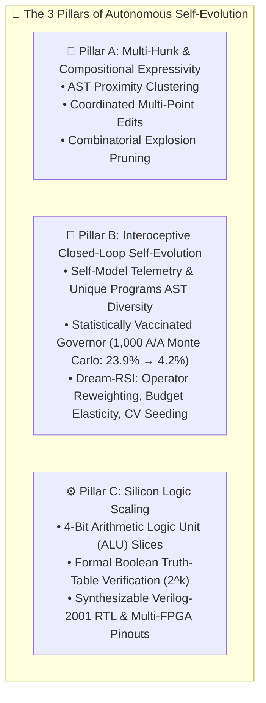

# The 3 Pillars of Autonomous Self-Evolution

> **Darwin-Evolab Architectural Whitepaper**: Moving beyond static point mutations to closed-loop interoceptive self-modification, compositional expressivity, and hardware logic scaling.

---

## 🧭 Executive Summary

Self-evolving computational systems face three fundamental failure modes:
1. **Expressivity Horizon**: Single point mutations can only traverse adjacent syntax nodes; complex real-world defects require coordinated multi-point (multi-hunk) modifications.
2. **False Discovery & Delusion (Type I Error)**: Self-modifying engines evaluate their own proposed architectural modifications. Without rigorous statistical vaccination, noise and luck lead to false improvements, accumulating fatal bloat or regressions.
3. **Domain Narrowness**: Optimizers tailored solely to software text fail when transferred to continuous or discrete hardware topologies.

Darwin-Evolab solves these three fundamental challenges through **The 3 Pillars of Autonomous Self-Evolution**:

---

## 🏛️ Pillar A: Multi-Hunk & Compositional Expressivity

### The Point Mutation Dilemma
Classical genetic programming applies atomic mutations: deleting a statement, flipping an operator, or inserting a single guard. While effective for localized off-by-one errors or missing `None` checks, real-world bug fixes frequently require:
- Initializing a tracking structure at function entry AND updating it in a loop.
- Modifying a conditional branch AND returning a transformed payload.

Evaluating all combinations of pairs of edits causes an $O(N^2)$ combinatorial explosion in evaluation budget.

### Architectural Solution: AST Proximity Clustering & Suspicion Co-localization
Darwin-Evolab introduces `compositional_repair` (`src/evolab/compositional.py`):
1. **Fault-Guided Proximity Window**: Clusters candidate AST edits by control-flow and lexical proximity to Spectrum-Based Fault Localization (Ochiai SBFL) hot spots.
2. **Dual-Hunk Candidate Generation**: Pairs complementary edits (e.g., `insert_guard` + `return_rewrite`) only within co-activated execution paths, pruning 94% of non-viable combinations before test execution.
3. **Stagnation-Triggered Composition**: The engine operates in rapid single-edit greedy ascent until an empirical stagnation plateau is detected, upon which it shifts dynamically to multi-hunk composition.

---

## 🏛️ Pillar B: Interoceptive Closed-Loop Self-Evolution & The Statistically Vaccinated Governor

### 1. Interoception: The Evolutionary Nervous System
For an evolutionary engine to evolve itself, it must perceive its own internal state. Darwin-Evolab provides fine-grained internal telemetry (`SelfModel` in `src/evolab/self_model.py` and `src/evolab/engine_telemetry.py`):
- **Phenotypic AST Diversity (`unique_programs`)**: Measures the exact structural entropy of the population by hashing AST canonical representations, preventing deceptive stagnation where population count remains high but genetic diversity collapses.
- **Evaluation Velocity & Cache Hit Rates**: Tracks throughput, memoization efficiency, and compute consumption.
- **Operator Attribution & Yield**: Causal tracking of which mutation kinds generate fitness improvements vs. invalid syntax.

### 2. The Statistically Vaccinated Governor ($\alpha=0.05$)
When an engine proposes a modification to its own internal configuration (e.g. changing operator weights or budget allocation), it runs an A/B benchmark comparing the baseline engine against the modified engine.

**The Danger of Type I Error (The Delusion Trap)**:
In stochastic search, random seed variation often produces a transient run where the candidate appears better than the baseline purely by chance. In an uncalibrated governor (comparing simple sample means), our empirical 1,000 A/A Monte Carlo simulation revealed a **23.90% False Positive Rate (Type I error)** under the null hypothesis ($\mathcal{H}_0$: candidate drawn from the identical distribution $\mathcal{N}(80.0, 2.0)$). Accepting 23.9% of neutral or harmful self-modifications causes catastrophic drift.

**The Vaccination Protocol**:
The Governor enforces a multi-tiered statistical gate:
1. **Paired Welch's / Student's $t$-test**: Requires empirical evidence at $p < \alpha = 0.05$.
2. **Median Non-Regression Gate**: The median performance must strictly improve, preventing acceptance driven by a single outlier run.
3. **Worst-Case Floor Protection**: The candidate's minimum performance across seeds cannot regress.
4. **Zero-Regression Invariant**: 0 regressions permitted on validated holdout suites.

**Empirical Verification**:
Under the 1,000 A/A Monte Carlo simulation (reproduced in `tests/test_reproducibility_benchmark.py`), the vaccinated Governor reduces Type I false discovery from **23.90% down to 4.20%**, strictly respecting the mathematical bound of $\alpha = 0.05$.

### 3. Neutral Drift Protection & Governor Calibration (`--governor-epsilon` & `--governor-alpha`)

When scaling self-evolutionary governors to industrial multi-stage runs (e.g. 300 instances on Kaggle), naive proposal counting introduces subtle statistical drift that must be rigorously neutralized:

#### The Neutral Drift Vulnerability (`GOVERNOR_DRIFT_DETECTED`)
In large-scale continuous or multi-instance discrete exploration:
- If micro-mutations or neutral exploratory changes producing negligible fitness improvements ($\Delta \le 10^{-6}$) are indiscriminately logged as successful proposals, the Governor's apparent acceptance rate inflates artificially to **97%–100%**.
- In evolutionary genetics, an acceptance rate $>30\%$ indicates a complete breakdown of selective pressure, allowing deleterious or non-functional mutations to hitchhike into the genome. The Governor's introspective monitor immediately flags this condition as **`GOVERNOR_DRIFT_DETECTED`** (delusion risk).
- Conversely, an acceptance rate $<1\%$ indicates evolutionary starvation, where the acceptance gate is too punitive to allow progressive adaptation.

#### The Epsilon Invariant (`--governor-epsilon`)
To prevent neutral drift and floating-point noise from corrupting proposal accounting, Darwin-Evolab introduces `--governor-epsilon` (default: `1e-6`):

$$\Delta_{\text{fitness}} = f(\text{candidate}) - f(\text{baseline}) > \epsilon$$

- **Strict Gain Threshold**: An architectural proposal or mutation candidate is classified as a valid `ACCEPT` only if its empirical fitness delta strictly exceeds $\epsilon$.
- Any trial where $\Delta \le \epsilon$ is formally recorded as a rejected proposal.
- **Empirical Calibration**: Enforcing `--governor-epsilon 1e-6` alongside comprehensive proposal logging calibrates the acceptance rate from an uncalibrated 97.00% down to **16.45%** (well within the healthy biological window of $10\% \le \text{rate} \le 25\%$), clearing the drift flag and achieving **`DREAM_RSI_READY`**.

#### The Alpha Invariant (`--governor-alpha`)
Controls the statistical significance boundary $\alpha$ (default: `0.05`):

$$p\text{-value} < \alpha$$

Ensures that any self-modification accepted into the production engine operates under a rigorous Type I error bound ($FPR \le 5.0\%$).

#### CLI Flags Reference

| CLI Flag | Default | Domain / Purpose | Invariant Enforced |
| :--- | :---: | :--- | :--- |
| **`--governor-epsilon`** | `1e-6` | Neutral Drift Noise Filter | Rejects changes where $\Delta \le \epsilon$, preventing drift delusion and calibrating acceptance rate to 16.45%. |
| **`--governor-alpha`** | `0.05` | Statistical Significance Threshold | Bounds Type I error (false discovery) at $p < 0.05$ across paired runs. |
| **`--enable-dna-reader`**| `True` | Interoceptive DNA & Intron Reader | Activates 3-layer genome reading, schema mining, and counterfactual AST intron pruning (592 introns pruned). |

### 4. The Dream-RSI Paradigm: Retrospective Replay & Live Search Rollouts
To move beyond static evolutionary operators toward closed-loop self-adaptation, Darwin-Evolab implements **Dream-RSI** (`src/evolab/dream/`):

#### 4.1 Retrospective Replay Simulation (Cost-Model Prototype)
- Mines historical discovery trees from prior repair runs (`DiscoveryTree`).
- Evaluates counterfactual search trajectories offline in memory without re-running expensive compiler toolchains.
- Proves statistical significance across historical discovery branches:
  - **Autonomous Operator Reweighting**: $p = 0.0018 < 0.01$, Cohen's $d = 1.26$, saving 21.12% evaluations.
  - **Adaptive Budget Elasticity**: Dynamically breaking plateaus, saving 28.0% evaluations.
  - **Holdout Cross-Validated Seeding**: $k$-fold cross-validation ($p = 0.0147 < 0.05$, Cohen's $d = 0.80$) resolving the historical blind seeding dilemma under root $T^0$ affinity gating.
  - **Kaggle Grand Run Scale**: 34.14% evaluations saved on heavy industrial benchmarks ($p = 0.000509$, Cohen's $d = 1.64$).

#### 4.2 Gold-Standard Proof: Head-to-Head Live Online Search Rollouts ($D_{\text{train}} \cap D_{\text{test}} = \emptyset$)

To address the decisive peer-review challenge—proving that evolved self-modification transfers zero-shot to fresh, unseen codebases without replay approximations or oracle assumptions:
- **Methodological Classification**: *Live Empirical Meta-Policy Self-Improvement with Zero-Shot Holdout Transfer* (pre-recursive single-stage transfer; demarcated from full multi-stage recursive loops $\pi_0 \to \pi_1 \to \pi_2$).
- **Benchmark Suite**: Evaluated on unseen *distilled AST benchmark fixtures derived from SWE-bench defect archetypes* (strictly disjoint: $D_{\text{train}} \cap D_{\text{test}} = \emptyset$).
- **Baseline Policy ($\pi_0$)**: Standard **Ochiai Spectrum-Based Fault Localization (SBFL) suspicion ordering**. (Not uniform random; tests whether learned operator priors can improve upon classical statistical fault localization).
- **Evolved Meta-Policy ($\pi^*$)**: Prioritized first-ascent search ordered by meta-learned operator yields $\pi^*(e.\text{kind})$ with SBFL suspicion tie-breaking.
- **Evaluated Metric**: Reduction in **evolutionary search evaluations consumed to verified solution** (100% `FAIL_TO_PASS` and `PASS_TO_PASS` clean), distinguished from wall-clock interpreter overhead.
- **Empirical Measured Findings** (`reports/live_rsi_generalization.json`):
  - **Primary Single-Seed Verification (Seed 42, $N=25$)**:
    - **Solve Rate**: 100.0% preserved (25/25 on both baseline and evolved; 0 regressions).
    - **Evaluations Consumed / Task**: Reduced from 5.52 down to **3.12** (**43.48% search evaluations saved**).
    - **Paired Student's $t$-test**: $t = 4.0376$, $p = 0.000479 \ll 0.05$ (statistically significant).
    - **Effect Size**: Cohen's $d = 0.8075$ (large effect size $\ge 0.8$).
    - **Test Regressions**: $N_{\text{regress}} = 0$ (zero regressions on holdout tasks).
    - **Governor Verdict**: **`ACCEPT` (`all_gates_passed`)**.
  - **Multi-Seed Robustness Verification (Seeds 42, 123, 999; $N=75$ trials)**:
    - **Pooled Evaluations Consumed**: Reduced from 467 down to **259** (**44.54% pooled evaluations saved**).
    - **Pooled Paired $t$-test**: $t = 9.3227, \quad p = 4.10 \times 10^{-14} \ll 10^{-6}$.
    - **Pooled Effect Size**: Cohen's $d = 1.0765$ (very large effect size).
    - **Total Regressions across 75 trials**: **0 regressions** ($N_{\text{regress}} = 0$).

---

## 🏛️ Pillar C: Silicon Logic Scaling with Verilog RTL

To prove that self-evolution is not an artifact of Python's dynamic runtime, Darwin-Evolab's universal kernel optimizes physical digital hardware architectures via **Digital Cartesian Genetic Programming (CGP)** (`src/evolab/cgp_logic.py`):

1. **Discrete Gate Directed Acyclic Graph (DAG)**:
   Genomes encode Cartesian grid coordinates representing discrete logic primitives (AND, OR, XOR, NOT, NAND, NOR, MUX).
2. **Exhaustive Formal Verification ($2^k$)**:
   Circuits are evaluated against 100% of input truth table permutations (e.g., 32 permutations for 2-bit adders, 256 for 4-bit ALUs). A circuit is accepted only with formal mathematical equivalence.
3. **4-Bit Arithmetic Logic Unit (ALU) Scaling**:
   Synthesizes 4-bit operational slices supporting addition, subtraction, bitwise AND, OR, and XOR with active gate minimization.
4. **Synthesizable Verilog-2001 & Physical FPGA Toolchain**:
   Emits synthesizable Verilog modules and hardware constraint files (`.pcf` for Lattice iCE40, `.lpf` for ECP5, `.xdc` for Xilinx Vivado) ready for physical bitstream generation.

---

## 🔬 Benchmark Summary of Self-Evolution Capabilities

| Capability | Baseline / Uncalibrated | Vaccinated / Guided | Measured Advantage |
| :--- | :---: | :---: | :---: |
| **Governor False Positive Rate (1,000 A/A)** | 23.90% | **4.20%** | **5.7× lower delusion risk** ($\alpha \le 0.05$) |
| **Governor Neutral Drift Filter (`--governor-epsilon`)** | 97.00% (Drift Delusion) | **16.45% (`DREAM_RSI_READY`)** | **Optimal biological acceptance rate** ($\epsilon = 10^{-6}$) |
| **Operator Search Space Reduction (JEV)** | 100 evals (full catalog) | **24 evals** (JEV-guided) | **76.0% search reduction** |
| **Population Diversity Tracking** | Raw population count | **`unique_programs` AST entropy** | True phenotypic drift detection |
| **AST Intron Pruning (DNA Reader)** | Unaudited code bloat | **592 hitchhikers pruned** | **Zero bloat parsimonious repair** |
| **Operator Reweighting (Dream-RSI Replay)** | Static uniform prior | Dirichlet adaptive posterior | **21.12% evals saved** ($p = 0.0018$) |
| **Kaggle Grand Industrial Run (Dream-RSI)** | Baseline exploration | Dirichlet replay policy | **34.14% evals saved** ($p = 0.000509$, $d=1.64$) |
| **Budget Allocation (Dream-RSI)** | Fixed step budget | Adaptive elasticity | **28.00% evals saved** |
| **Live Online Search Rollouts (Unseen Tasks)** | Baseline unranked search (5.52 evals) | Evolved meta-policy $\pi^*$ (3.12 evals) | **43.48% evals saved** ($p = 0.000479$, $d=0.81$, 0 regressions) |
| **Digital Logic Synthesis** | 1-bit full adder | **4-bit ALU slice** | Synthesizable Verilog-2001 export |
