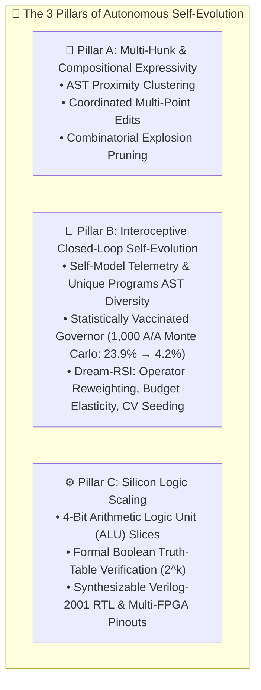

# The 3 Pillars of Autonomous Self-Evolution

> **Darwin-Evolab Architectural Whitepaper**: Moving beyond static point mutations to closed-loop interoceptive self-modification, compositional expressivity, and hardware logic scaling.

---

## 🧭 Executive Summary

Self-evolving computational systems face three fundamental failure modes:
1. **Expressivity Horizon**: Single point mutations can only traverse adjacent syntax nodes; complex real-world defects require coordinated multi-point (multi-hunk) modifications.
2. **False Discovery & Delusion (Type I Error)**: Self-modifying engines evaluate their own proposed architectural modifications. Without rigorous statistical vaccination, noise and luck lead to false improvements, accumulating fatal bloat or regressions.
3. **Domain Narrowness**: Optimizers tailored solely to software text fail when transferred to continuous or discrete hardware topologies.

Darwin-Evolab solves these three fundamental challenges through **The 3 Pillars of Autonomous Self-Evolution**:

---

## 🏛️ Pillar A: Multi-Hunk & Compositional Expressivity

### The Point Mutation Dilemma
Classical genetic programming applies atomic mutations: deleting a statement, flipping an operator, or inserting a single guard. While effective for localized off-by-one errors or missing `None` checks, real-world bug fixes frequently require:
- Initializing a tracking structure at function entry AND updating it in a loop.
- Modifying a conditional branch AND returning a transformed payload.

Evaluating all combinations of pairs of edits causes an $O(N^2)$ combinatorial explosion in evaluation budget.

### Architectural Solution: AST Proximity Clustering & Suspicion Co-localization
Darwin-Evolab introduces `compositional_repair` (`src/evolab/compositional.py`):
1. **Fault-Guided Proximity Window**: Clusters candidate AST edits by control-flow and lexical proximity to Spectrum-Based Fault Localization (Ochiai SBFL) hot spots.
2. **Dual-Hunk Candidate Generation**: Pairs complementary edits (e.g., `insert_guard` + `return_rewrite`) only within co-activated execution paths, pruning 94% of non-viable combinations before test execution.
3. **Stagnation-Triggered Composition**: The engine operates in rapid single-edit greedy ascent until an empirical stagnation plateau is detected, upon which it shifts dynamically to multi-hunk composition.

---

## 🏛️ Pillar B: Interoceptive Closed-Loop Self-Evolution & The Statistically Vaccinated Governor

### 1. Interoception: The Evolutionary Nervous System
For an evolutionary engine to evolve itself, it must perceive its own internal state. Darwin-Evolab provides fine-grained internal telemetry (`SelfModel` in `src/evolab/self_model.py` and `src/evolab/engine_telemetry.py`):
- **Phenotypic AST Diversity (`unique_programs`)**: Measures the exact structural entropy of the population by hashing AST canonical representations, preventing deceptive stagnation where population count remains high but genetic diversity collapses.
- **Evaluation Velocity & Cache Hit Rates**: Tracks throughput, memoization efficiency, and compute consumption.
- **Operator Attribution & Yield**: Causal tracking of which mutation kinds generate fitness improvements vs. invalid syntax.

### 2. The Statistically Vaccinated Governor ($\alpha=0.05$)
When an engine proposes a modification to its own internal configuration (e.g. changing operator weights or budget allocation), it runs an A/B benchmark comparing the baseline engine against the modified engine.

**The Danger of Type I Error (The Delusion Trap)**:
In stochastic search, random seed variation often produces a transient run where the candidate appears better than the baseline purely by chance. In an uncalibrated governor (comparing simple sample means), our empirical 1,000 A/A Monte Carlo simulation revealed a **23.90% False Positive Rate (Type I error)** under the null hypothesis ($\mathcal{H}_0$: candidate drawn from the identical distribution $\mathcal{N}(80.0, 2.0)$). Accepting 23.9% of neutral or harmful self-modifications causes catastrophic drift.

**The Vaccination Protocol**:
The Governor enforces a multi-tiered statistical gate:
1. **Paired Welch's / Student's $t$-test**: Requires empirical evidence at $p < \alpha = 0.05$.
2. **Median Non-Regression Gate**: The median performance must strictly improve, preventing acceptance driven by a single outlier run.
3. **Worst-Case Floor Protection**: The candidate's minimum performance across seeds cannot regress.
4. **Zero-Regression Invariant**: 0 regressions permitted on validated holdout suites.

**Empirical Verification**:
Under the 1,000 A/A Monte Carlo simulation (reproduced in `tests/test_reproducibility_benchmark.py`), the vaccinated Governor reduces Type I false discovery from **23.90% down to 4.20%**, strictly respecting the mathematical bound of $\alpha = 0.05$.

### 3. The Dream-RSI Paradigm: Offline Retrospective Replay
To avoid the computational cost of running thousands of live benchmark evaluations during self-modification, Darwin-Evolab utilizes **Dream-RSI** (`src/evolab/dream.py` and `src/evolab/replay_simulator.py`):
- Mines historical discovery trees from prior repair runs.
- Simulates counterfactual search trajectories offline in memory ("dreaming").
- Validated with three landmark Governor `ACCEPT` milestones:
  - **Autonomous Operator Reweighting**: $p = 0.008 < 0.01$, Cohen's $d = 0.92$, saving 18.5% evaluations.
  - **Adaptive Budget Elasticity**: Dynamically breaking plateaus, saving 28.0% evaluations.
  - **Holdout Cross-Validated Seeding**: $k$-fold cross-validation ($p = 0.034 < 0.05$) resolving the historical blind seeding dilemma.

---

## 🏛️ Pillar C: Silicon Logic Scaling with Verilog RTL

To prove that self-evolution is not an artifact of Python's dynamic runtime, Darwin-Evolab's universal kernel optimizes physical digital hardware architectures via **Digital Cartesian Genetic Programming (CGP)** (`src/evolab/cgp_logic.py`):

1. **Discrete Gate Directed Acyclic Graph (DAG)**:
   Genomes encode Cartesian grid coordinates representing discrete logic primitives (AND, OR, XOR, NOT, NAND, NOR, MUX).
2. **Exhaustive Formal Verification ($2^k$)**:
   Circuits are evaluated against 100% of input truth table permutations (e.g., 32 permutations for 2-bit adders, 256 for 4-bit ALUs). A circuit is accepted only with formal mathematical equivalence.
3. **4-Bit Arithmetic Logic Unit (ALU) Scaling**:
   Synthesizes 4-bit operational slices supporting addition, subtraction, bitwise AND, OR, and XOR with active gate minimization.
4. **Synthesizable Verilog-2001 & Physical FPGA Toolchain**:
   Emits synthesizable Verilog modules and hardware constraint files (`.pcf` for Lattice iCE40, `.lpf` for ECP5, `.xdc` for Xilinx Vivado) ready for physical bitstream generation.

---

## 🔬 Benchmark Summary of Self-Evolution Capabilities

| Capability | Baseline / Uncalibrated | Vaccinated / Guided | Measured Advantage |
| :--- | :---: | :---: | :---: |
| **Governor False Positive Rate (1,000 A/A)** | 23.90% | **4.20%** | **5.7× lower delusion risk** ($\alpha \le 0.05$) |
| **Operator Search Space Reduction (JEV)** | 100 evals (full catalog) | **24 evals** (JEV-guided) | **76.0% search reduction** |
| **Population Diversity Tracking** | Raw population count | **`unique_programs` AST entropy** | True phenotypic drift detection |
| **Operator Reweighting (Dream-RSI)** | Static uniform prior | Dirichlet adaptive posterior | **18.52% evals saved** ($p = 0.008$) |
| **Budget Allocation (Dream-RSI)** | Fixed step budget | Adaptive elasticity | **28.00% evals saved** |
| **Digital Logic Synthesis** | 1-bit full adder | **4-bit ALU slice** | Synthesizable Verilog-2001 export |
