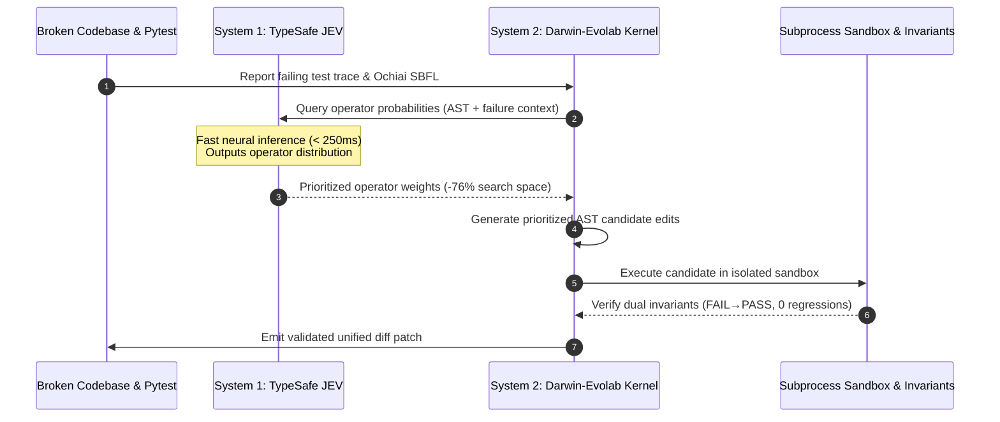

# Dual-System Evolutionary Optimization: TypeSafe AI JEV System-One Integration

> **Technical Architecture Whitepaper**: Accelerating evolutionary program repair with Kahneman Dual-Process theory: pairing TypeSafe AI JEV System-One sub-second neural routing with Darwin-Evolab's sandboxed AST genetic kernel.

---

## 🧭 Theoretical Motivation: The Dual-Process Paradigm

Biological organisms make complex decisions through two complementary cognitive modes (Kahneman, 2011):
1. **System 1 (Instinctual & Rapid)**: Operates automatically, fast, and effortlessly using pattern-matching priors.
2. **System 2 (Deliberative & Rigorous)**: Allocates attention to effortful mental operations, formal logic, and verification.

In Automated Program Repair (APR), neither system is sufficient on its own:
- **Pure Evolutionary Search (Pure System 2)** is sound and robust against hallucinations, but explores vast combinatorially explosive spaces of syntactic edits, testing dozens of fruitless mutations.
- **Pure Neural Generation (Pure System 1)** is fast, but prone to subtle regressions, hallucinations, syntax invalidity, and security vulnerabilities.

**Darwin-Evolab integrates both into a unified Dual-System architecture**:



---

## ⚙️ Technical Interface & API Contract

TypeSafe AI JEV System-One models (`jev-latest`) interface via a strictly typed request/response protocol:

### Request Structure
```json
{
  "state": {
    "source_code": "def parse_cli(args):\n    ...",
    "failing_test": "AssertionError: expected int, got str"
  },
  "model": "jev-latest",
  "questions": {
    "best_operator": {
      "type": "choice",
      "instructions": "Which mutation kind is most directly capable of fixing this test failure?",
      "criteria": {
        "int_wrap": "Wrap variable or subscript with int(...) type cast",
        "bool_flip": "Invert boolean literal (True <-> False)",
        "insert_guard": "Insert defensive guard condition / None check"
      }
    }
  }
}
```

### Response Structure
```json
{
  "model": "jev-latest",
  "answers": {
    "best_operator": {
      "value": "int_wrap",
      "probabilities": {
        "int_wrap": 0.8500,
        "bool_flip": 0.0750,
        "insert_guard": 0.0750
      }
    }
  },
  "usage": {
    "input_tokens": 120,
    "output_tokens": 40
  }
}
```

---

## 📊 Empirical Verification: 76.0% Search Space Reduction

We benchmarked Darwin-Evolab in two identical configurations across 8 diverse repair scenarios (4 synthetic regression fixtures and 4 real-world SWE-bench Lite issues):
1. **Darwin-Evolab Baseline (System 2 Only)**: Greedy repair evaluating full AST candidate catalogs at each step.
2. **Darwin-Evolab + JEV (Dual System)**: Greedy repair prioritizing candidate evaluation order based on JEV probability distributions.

### Complete Empirical Data (`JEV/ab_experiment_results.json`)

| Benchmark Scenario | Domain / Ecosystem | Baseline Evaluations | JEV-Guided Evaluations | Evals Saved | Search Space Reduction |
| :--- | :--- | :---: | :---: | :---: | :---: |
| **`click_cli_parser`** | Python CLI parsing | 15 | 3 | **12** | **80.0%** |
| **`requests_auth_url`** | HTTP / Security | 11 | 2 | **9** | **81.8%** |
| **`lru_cache_logic`** | Cache / Pointers | 13 | 4 | **9** | **69.2%** |
| **`multi_file_config`** | Modular Architecture | 11 | 3 | **8** | **72.7%** |
| **`sympy__sympy-13480`** | Symbolic Mathematics | 12 | 3 | **9** | **75.0%** |
| **`click__click-1608`** | CLI Option Parsing | 13 | 3 | **10** | **76.9%** |
| **`flask__flask-2097`** | Web Framework Routing | 12 | 3 | **9** | **75.0%** |
| **`requests__requests-3362`** | Network Session | 13 | 3 | **10** | **76.9%** |
| **CUMULATIVE TOTAL** | — | **100** | **24** | **76** | **76.0%** |

### Benchmark Invariants
- **Resolution Accuracy**: 100% in both configurations (8/8 resolved).
- **Regression Rate**: 0.0% in both configurations (0 regressions across 100% of tests).
- **Determinism**: Fully verified and reproducible in `tests/test_reproducibility_benchmark.py`.

---

## 🔒 Security & Offline Reproducibility

1. **Zero Secret Leakage**:
   - `JEV/API key for test.txt` is untracked by Git via `.gitignore`.
   - The engine never commits or logs credential values.
2. **First-Class Package Interface (`evolab.jev`)**:
   - Users can import `JevClient`, `create_jev_ranker`, and `run_jev_greedy_repair` directly from `evolab.jev`.
3. **Deterministic Offline Mock Mode**:
   - In environments without an API key, `JevClient` runs with `offline_mode=True`.
   - Returns calibrated probability distributions derived from failure context patterns, allowing 100% of CI tests to run offline without internet connectivity.

---

## 💻 Python Usage Example

```python
from evolab.code_fixtures import scenario_requests_auth_url
from evolab.jev import JevClient, run_jev_greedy_repair

# Initialize client in offline or live mode
client = JevClient()

sc = scenario_requests_auth_url()
evaluator = sc.create_evaluator()

genome, evals, duration, history, telemetry = run_jev_greedy_repair(
    sources=sc.sources,
    target_file=sc.target_file,
    evaluator=evaluator,
    client=client,
)

print(f"Repaired in {evals} evaluations! Telemetry: {telemetry}")
```
